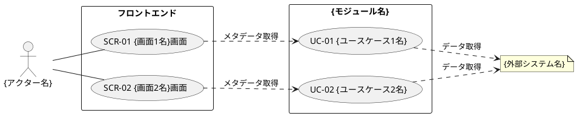

# ユースケース図

{モジュール名}のユースケース図を定義します。

## ユースケース図

```plantuml
@startuml
left to right direction

actor "{アクター名}" as actor
rectangle "フロントエンド" {
  usecase "SCR-01 {画面1名}画面" as SCR01
  usecase "SCR-02 {画面2名}画面" as SCR02
}

rectangle "{モジュール名}" {
  usecase "UC-01 {ユースケース1名}" as UC01
  usecase "UC-02 {ユースケース2名}" as UC02
}

note "{外部システム名}" as external

actor -- SCR01
actor -- SCR02

SCR01 ..> UC01 : メタデータ取得
SCR02 ..> UC02 : メタデータ取得

UC01 ..> external : データ取得
UC02 ..> external : データ取得

@enduml
```

## 関連情報

- アクター: {アクター名}
- 外部システム: {外部システム名}
- ユースケース数: {数}

