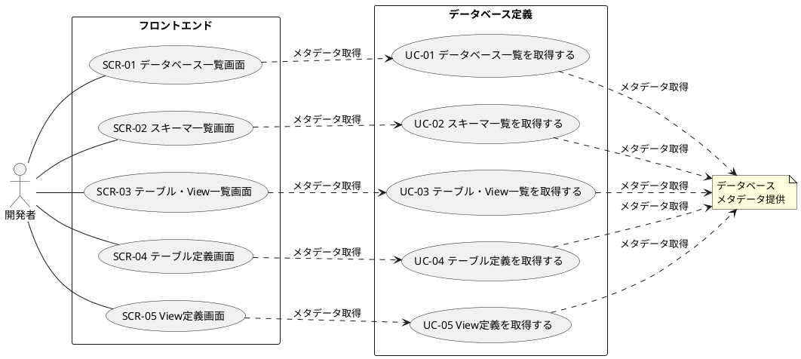

# ユースケース図

データベース定義のユースケース図を定義します。

## ユースケース図

```plantuml
@startuml
left to right direction

actor "開発者" as developer
rectangle "フロントエンド" {
  usecase "SCR-01 データベース一覧画面" as SCR01
  usecase "SCR-02 スキーマ一覧画面" as SCR02
  usecase "SCR-03 テーブル・View一覧画面" as SCR03
  usecase "SCR-04 テーブル定義画面" as SCR04
  usecase "SCR-05 View定義画面" as SCR05
}

rectangle "データベース定義" {
  usecase "UC-01 データベース一覧を取得する" as UC01
  usecase "UC-02 スキーマ一覧を取得する" as UC02
  usecase "UC-03 テーブル・View一覧を取得する" as UC03
  usecase "UC-04 テーブル定義を取得する" as UC04
  usecase "UC-05 View定義を取得する" as UC05
}

note "データベース\nメタデータ提供" as db

developer -- SCR01
developer -- SCR02
developer -- SCR03
developer -- SCR04
developer -- SCR05

SCR01 ..> UC01 : メタデータ取得
SCR02 ..> UC02 : メタデータ取得
SCR03 ..> UC03 : メタデータ取得
SCR04 ..> UC04 : メタデータ取得
SCR05 ..> UC05 : メタデータ取得

UC01 ..> db : メタデータ取得
UC02 ..> db : メタデータ取得
UC03 ..> db : メタデータ取得
UC04 ..> db : メタデータ取得
UC05 ..> db : メタデータ取得

@enduml
```

## 関連情報

- アクター: 開発者
- 外部システム: データベース
- ユースケース数: 5
