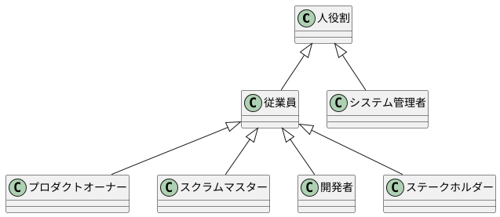

```puml
@startuml
class 人役割
class 従業員
class プロダクトオーナー
class スクラムマスター
class 開発者
class ステークホルダー
class システム管理者

人役割 <|-- 従業員
従業員 <|-- ステークホルダー
従業員 <|-- 開発者
従業員 <|-- プロダクトオーナー
従業員 <|-- スクラムマスター
人役割 <|-- システム管理者

@enduml
```
