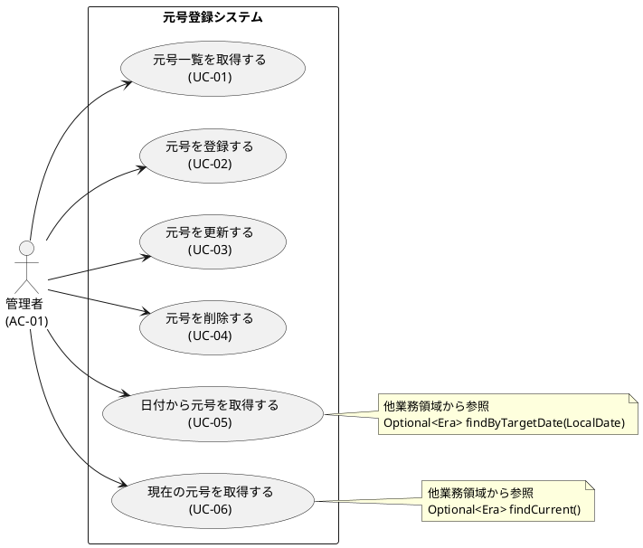

# ユースケース図

## 元号登録 ユースケース図

```plantuml
@startuml
left to right direction
skinparam packageStyle rectangle

actor "管理者\n(AC-01)" as admin

package "元号登録システム" {
  usecase "元号一覧を取得する\n(UC-01)" as uc1
  usecase "元号を登録する\n(UC-02)" as uc2
  usecase "元号を更新する\n(UC-03)" as uc3
  usecase "元号を削除する\n(UC-04)" as uc4
  usecase "日付から元号を取得する\n(UC-05)" as uc5
  usecase "現在の元号を取得する\n(UC-06)" as uc6
}

admin --> uc1
admin --> uc2
admin --> uc3
admin --> uc4
admin --> uc5
admin --> uc6

note right of uc5
  他業務領域から参照
  Optional<Era> findByTargetDate(LocalDate)
end note

note right of uc6
  他業務領域から参照
  Optional<Era> findCurrent()
end note
@enduml
```

## 図の説明

管理者は元号の一覧取得、登録、更新、削除、日付指定検索、現在元号取得の6つのユースケースを利用できます。UC-05とUC-06は他業務領域からの参照用APIとして提供されます。
