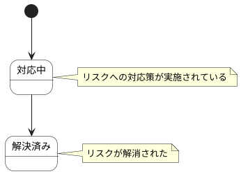

# 対応策 ステートチャート

対応策情報の状態遷移を示します。

```plantuml
@startuml
skinparam state {
  BackgroundColor White
  BorderColor Black
}

state "対応中" as addressing
state "解決済み" as resolved

[*] --> addressing
addressing --> resolved

note right of addressing
  リスクへの対応策が実施されている
end note

note right of resolved
  リスクが解消された
end note
@enduml
```

## 状態一覧

| 状態ID | 状態名 | 説明 |
|--------|--------|------|
| ST-PR-11 | 対応中 | リスクへの対応策が実施されている |
