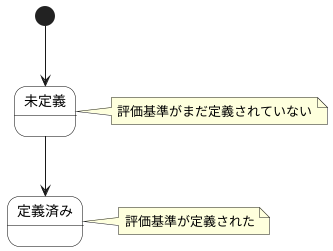

# 評価基準 ステートチャート

評価基準情報の状態遷移を示します。

```plantuml
@startuml
skinparam state {
  BackgroundColor White
  BorderColor Black
}

state "未定義" as undefined
state "定義済み" as defined

[*] --> undefined
undefined --> defined

note right of undefined
  評価基準がまだ定義されていない
end note

note right of defined
  評価基準が定義された
end note
@enduml
```

## 状態一覧

| 状態ID | 状態名 | 説明 |
|--------|--------|------|
| ST-PR-01 | 未定義 | 評価基準がまだ定義されていない |
| ST-PR-02 | 定義済み | 評価基準が定義された |
