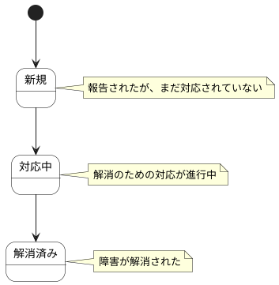

# 障害 ステートチャート

障害情報の状態遷移を示します。

```plantuml
@startuml
skinparam state {
  BackgroundColor White
  BorderColor Black
}

state "新規" as new
state "対応中" as addressing
state "解消済み" as resolved

[*] --> new
new --> addressing
addressing --> resolved

note right of new
  報告されたが、まだ対応されていない
end note

note right of addressing
  解消のための対応が進行中
end note

note right of resolved
  障害が解消された
end note
@enduml
```

## 状態一覧

| 状態ID | 状態名 | 説明 |
|--------|--------|------|
| ST-SP-09 | 新規 | 報告されたが、まだ対応されていない |
| ST-SP-10 | 対応中 | 解消のための対応が進行中 |
| ST-SP-11 | 解消済み | 障害が解消された |
