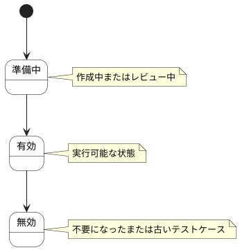

# テストケース ステートチャート

テストケース情報の状態遷移を示します。

```plantuml
@startuml
skinparam state {
  BackgroundColor White
  BorderColor Black
}

state "準備中" as preparing
state "有効" as active
state "無効" as inactive

[*] --> preparing
preparing --> active
active --> inactive

note right of preparing
  作成中またはレビュー中
end note

note right of active
  実行可能な状態
end note

note right of inactive
  不要になったまたは古いテストケース
end note
@enduml
```

## 状態一覧

| 状態ID | 状態名 | 説明 |
|--------|--------|------|
| ST-QL-07 | 準備中 | 作成中またはレビュー中 |
| ST-QL-08 | 有効 | 実行可能な状態 |
| ST-QL-09 | 無効 | 不要になったまたは古いテストケース |
