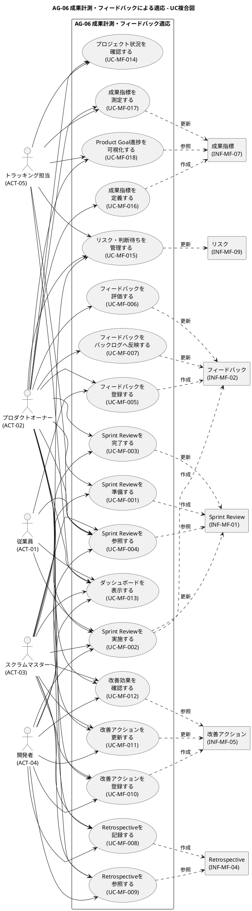

# UC複合図

成果計測・フィードバックによる適応業務領域（AG-06）のユースケース複合図をPlantUMLで定義します。

```plantuml
@startuml
title AG-06 成果計測・フィードバックによる適応 - UC複合図

left to right direction
skinparam packageStyle rectangle

actor "従業員\n(ACT-01)" as Employee
actor "プロダクトオーナー\n(ACT-02)" as PO
actor "スクラムマスター\n(ACT-03)" as SM
actor "開発者\n(ACT-04)" as Dev
actor "トラッキング担当\n(ACT-05)" as Tracker

rectangle "AG-06 成果計測・フィードバック適応" as System {
  usecase "Sprint Reviewを\n準備する\n(UC-MF-001)" as UC001
  usecase "Sprint Reviewを\n実施する\n(UC-MF-002)" as UC002
  usecase "Sprint Reviewを\n完了する\n(UC-MF-003)" as UC003
  usecase "Sprint Reviewを\n参照する\n(UC-MF-004)" as UC004

  usecase "フィードバックを\n登録する\n(UC-MF-005)" as UC005
  usecase "フィードバックを\n評価する\n(UC-MF-006)" as UC006
  usecase "フィードバックを\nバックログへ反映する\n(UC-MF-007)" as UC007

  usecase "Retrospectiveを\n記録する\n(UC-MF-008)" as UC008
  usecase "Retrospectiveを\n参照する\n(UC-MF-009)" as UC009

  usecase "改善アクションを\n登録する\n(UC-MF-010)" as UC010
  usecase "改善アクションを\n更新する\n(UC-MF-011)" as UC011
  usecase "改善効果を\n確認する\n(UC-MF-012)" as UC012

  usecase "ダッシュボードを\n表示する\n(UC-MF-013)" as UC013
  usecase "プロジェクト状況を\n確認する\n(UC-MF-014)" as UC014
  usecase "リスク・判断待ちを\n管理する\n(UC-MF-015)" as UC015

  usecase "成果指標を\n定義する\n(UC-MF-016)" as UC016
  usecase "成果指標を\n測定する\n(UC-MF-017)" as UC017
  usecase "Product Goal進捗を\n可視化する\n(UC-MF-018)" as UC018
}

rectangle "Sprint Review\n(INF-MF-01)" as INF01
rectangle "フィードバック\n(INF-MF-02)" as INF02
rectangle "Retrospective\n(INF-MF-04)" as INF04
rectangle "改善アクション\n(INF-MF-05)" as INF05
rectangle "リスク\n(INF-MF-09)" as INF09
rectangle "成果指標\n(INF-MF-07)" as INF07

Employee --> UC002
Employee --> UC004
Employee --> UC005
Employee --> UC013

PO --> UC001
PO --> UC002
PO --> UC003
PO --> UC004
PO --> UC005
PO --> UC006
PO --> UC007
PO --> UC008
PO --> UC009
PO --> UC010
PO --> UC011
PO --> UC012
PO --> UC013
PO --> UC014
PO --> UC015
PO --> UC016
PO --> UC017
PO --> UC018

SM --> UC001
SM --> UC002
SM --> UC003
SM --> UC004
SM --> UC008
SM --> UC009
SM --> UC010
SM --> UC011
SM --> UC012
SM --> UC013
SM --> UC015

Dev --> UC002
Dev --> UC004
Dev --> UC008
Dev --> UC009
Dev --> UC010
Dev --> UC011
Dev --> UC012
Dev --> UC013

Tracker --> UC004
Tracker --> UC013
Tracker --> UC014
Tracker --> UC015
Tracker --> UC017
Tracker --> UC018

UC001 ..> INF01 : 作成
UC002 ..> INF01 : 更新
UC002 ..> INF02 : 作成
UC003 ..> INF01 : 更新
UC004 ..> INF01 : 参照
UC005 ..> INF02 : 作成
UC006 ..> INF02 : 更新
UC007 ..> INF02 : 更新
UC008 ..> INF04 : 作成
UC009 ..> INF04 : 参照
UC010 ..> INF05 : 作成
UC011 ..> INF05 : 更新
UC012 ..> INF05 : 参照
UC015 ..> INF09 : 更新
UC016 ..> INF07 : 作成
UC017 ..> INF07 : 更新
UC018 ..> INF07 : 参照

@enduml
```
