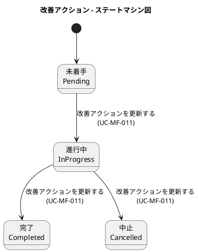
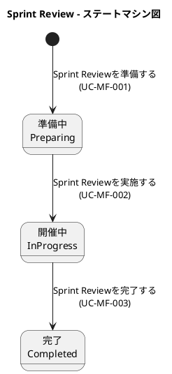
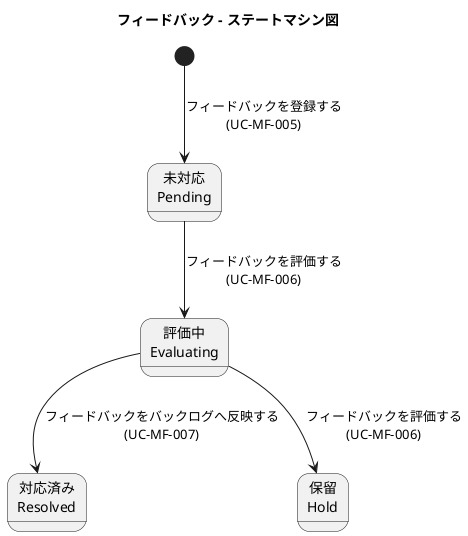
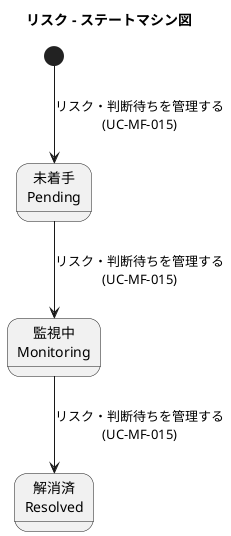
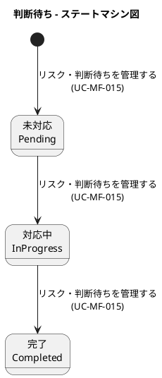

# ステートマシン図

成果計測・フィードバックによる適応業務領域（AG-06）のステートマシン図をPlantUMLで定義します。

## 改善アクションの状態遷移

```plantuml
@startuml
title 改善アクション - ステートマシン図

state "未着手\nPending" as Pending
state "進行中\nInProgress" as InProgress
state "完了\nCompleted" as Completed
state "中止\nCancelled" as Cancelled

[*] --> Pending
Pending --> InProgress : 改善アクションを更新する\n(UC-MF-011)
InProgress --> Completed : 改善アクションを更新する\n(UC-MF-011)
InProgress --> Cancelled : 改善アクションを更新する\n(UC-MF-011)
@enduml
```

## Sprint Reviewの状態遷移

```plantuml
@startuml
title Sprint Review - ステートマシン図

state "準備中\nPreparing" as Preparing
state "開催中\nInProgress" as InProgress
state "完了\nCompleted" as Completed

[*] --> Preparing : Sprint Reviewを準備する\n(UC-MF-001)
Preparing --> InProgress : Sprint Reviewを実施する\n(UC-MF-002)
InProgress --> Completed : Sprint Reviewを完了する\n(UC-MF-003)
@enduml
```

## フィードバックの状態遷移

```plantuml
@startuml
title フィードバック - ステートマシン図

state "未対応\nPending" as Pending
state "評価中\nEvaluating" as Evaluating
state "対応済み\nResolved" as Resolved
state "保留\nHold" as Hold

[*] --> Pending : フィードバックを登録する\n(UC-MF-005)
Pending --> Evaluating : フィードバックを評価する\n(UC-MF-006)
Evaluating --> Resolved : フィードバックをバックログへ反映する\n(UC-MF-007)
Evaluating --> Hold : フィードバックを評価する\n(UC-MF-006)
@enduml
```

## リスクの状態遷移

```plantuml
@startuml
title リスク - ステートマシン図

state "未着手\nPending" as Pending
state "監視中\nMonitoring" as Monitoring
state "解消済\nResolved" as Resolved

[*] --> Pending : リスク・判断待ちを管理する\n(UC-MF-015)
Pending --> Monitoring : リスク・判断待ちを管理する\n(UC-MF-015)
Monitoring --> Resolved : リスク・判断待ちを管理する\n(UC-MF-015)
@enduml
```

## 判断待ちの状態遷移

```plantuml
@startuml
title 判断待ち - ステートマシン図

state "未対応\nPending" as Pending
state "対応中\nInProgress" as InProgress
state "完了\nCompleted" as Completed

[*] --> Pending : リスク・判断待ちを管理する\n(UC-MF-015)
Pending --> InProgress : リスク・判断待ちを管理する\n(UC-MF-015)
InProgress --> Completed : リスク・判断待ちを管理する\n(UC-MF-015)
@enduml
```
