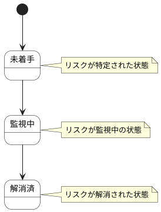

# リスク ステートチャート

リスク情報の状態遷移を示します。

```plantuml
@startuml
skinparam state {
  BackgroundColor White
  BorderColor Black
}

state "未着手" as pending
state "監視中" as monitoring
state "解消済" as resolved

[*] --> pending
pending --> monitoring
monitoring --> resolved

note right of pending
  リスクが特定された状態
end note

note right of monitoring
  リスクが監視中の状態
end note

note right of resolved
  リスクが解消された状態
end note
@enduml
```

## 状態一覧

| 状態ID | 状態名 | 説明 |
|--------|--------|------|
| ST-MF-012 | 未着手 | リスクが特定された状態 |
| ST-MF-013 | 監視中 | リスクが監視中の状態 |
| ST-MF-014 | 解消済 | リスクが解消された状態 |
