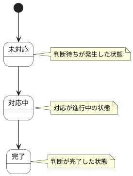

# 判断待ち ステートチャート

判断待ち情報の状態遷移を示します。

```plantuml
@startuml
skinparam state {
  BackgroundColor White
  BorderColor Black
}

state "未対応" as pending
state "対応中" as inprogress
state "完了" as completed

[*] --> pending
pending --> inprogress
inprogress --> completed

note right of pending
  判断待ちが発生した状態
end note

note right of inprogress
  対応が進行中の状態
end note

note right of completed
  判断が完了した状態
end note
@enduml
```

## 状態一覧

| 状態ID | 状態名 | 説明 |
|--------|--------|------|
| ST-MF-015 | 未対応 | 判断待ちが発生した状態 |
| ST-MF-016 | 対応中 | 対応が進行中の状態 |
| ST-MF-017 | 完了 | 判断が完了した状態 |
