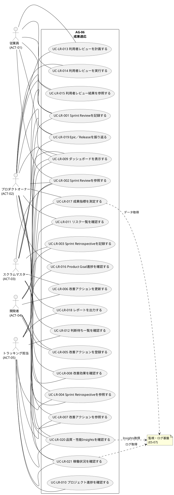

# ユースケース図

成果計測・フィードバックによる適応業務領域のユースケース図を示します。

```plantuml
@startuml
left to right direction

actor "従業員\n(ACT-01)" as employee
actor "プロダクトオーナー\n(ACT-02)" as po
actor "スクラムマスター\n(ACT-03)" as sm
actor "開発者\n(ACT-04)" as developer
actor "トラッキング担当\n(ACT-05)" as tracking

note "監視・ログ基盤\n(ES-07)" as es07

rectangle "AG-06\n成果適応" {
  usecase "UC-LR-001 Sprint Reviewを記録する" as uc1
  usecase "UC-LR-002 Sprint Reviewを参照する" as uc2
  usecase "UC-LR-003 Sprint Retrospectiveを記録する" as uc3
  usecase "UC-LR-004 Sprint Retrospectiveを参照する" as uc4
  usecase "UC-LR-005 改善アクションを登録する" as uc5
  usecase "UC-LR-006 改善アクションを更新する" as uc6
  usecase "UC-LR-007 改善アクションを参照する" as uc7
  usecase "UC-LR-008 改善効果を確認する" as uc8
  usecase "UC-LR-009 ダッシュボードを表示する" as uc9
  usecase "UC-LR-010 プロジェクト進捗を確認する" as uc10
  usecase "UC-LR-011 リスク一覧を確認する" as uc11
  usecase "UC-LR-012 判断待ち一覧を確認する" as uc12
  usecase "UC-LR-013 利用者レビューを計画する" as uc13
  usecase "UC-LR-014 利用者レビューを実行する" as uc14
  usecase "UC-LR-015 利用者レビュー結果を参照する" as uc15
  usecase "UC-LR-016 Product Goal進捗を確認する" as uc16
  usecase "UC-LR-017 成果指標を測定する" as uc17
  usecase "UC-LR-018 レポートを出力する" as uc18
  usecase "UC-LR-019 Epic／Releaseを振り返る" as uc19
  usecase "UC-LR-020 品質・性能Insightsを確認する" as uc20
  usecase "UC-LR-021 稼働状況を確認する" as uc21
}

employee -- uc1
employee -- uc2
employee -- uc9
employee -- uc13
employee -- uc14
employee -- uc15

po -- uc1
po -- uc2
po -- uc9
po -- uc11
po -- uc12
po -- uc13
po -- uc14
po -- uc15
po -- uc16
po -- uc17
po -- uc18
po -- uc19
po -- uc20
po -- uc21

sm -- uc1
sm -- uc2
sm -- uc3
sm -- uc4
sm -- uc5
sm -- uc6
sm -- uc7
sm -- uc8
sm -- uc9
sm -- uc19

developer -- uc1
developer -- uc2
developer -- uc3
developer -- uc4
developer -- uc5
developer -- uc6
developer -- uc7
developer -- uc8
developer -- uc9
developer -- uc19
developer -- uc20
developer -- uc21

tracking -- uc2
tracking -- uc4
tracking -- uc7
tracking -- uc9
tracking -- uc10
tracking -- uc11
tracking -- uc12
tracking -- uc16
tracking -- uc17
tracking -- uc18
tracking -- uc20
tracking -- uc21

uc17 ..> es07 : データ取得
uc20 ..> es07 : Insights取得
uc21 ..> es07 : ログ取得

@enduml
```

## 関連情報

- アクター: 従業員 (ACT-01)、プロダクトオーナー (ACT-02)、スクラムマスター (ACT-03)、開発者 (ACT-04)
  、トラッキング担当 (ACT-05)
- 外部システム: 監視・ログ基盤 (ES-07)
- ユースケース数: 21
