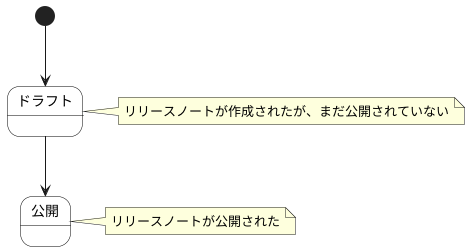

# リリースノート ステートチャート

リリースノート情報の状態遷移を示します。

```plantuml
@startuml
skinparam state {
  BackgroundColor White
  BorderColor Black
}

state "ドラフト" as draft
state "公開" as published

[*] --> draft
draft --> published

note right of draft
  リリースノートが作成されたが、まだ公開されていない
end note

note right of published
  リリースノートが公開された
end note
@enduml
```

## 状態一覧

| 状態ID | 状態名 | 説明 |
|--------|--------|------|
| ST-AD-06 | ドラフト | リリースノートが作成されたが、まだ公開されていない |
| ST-AD-07 | 公開 | リリースノートが公開された |
