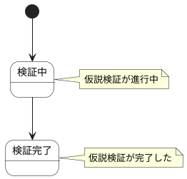

# 仮説検証 ステートチャート

仮説検証情報の状態遷移を示します。

```plantuml
@startuml
skinparam state {
  BackgroundColor White
  BorderColor Black
}

state "検証中" as verifying
state "検証完了" as completed

[*] --> verifying
verifying --> completed

note right of verifying
  仮説検証が進行中
end note

note right of completed
  仮説検証が完了した
end note
@enduml
```

## 状態一覧

| 状態ID | 状態名 | 説明 |
|--------|--------|------|
| ST-AD-12 | 検証中 | 仮説検証が進行中 |
| ST-AD-13 | 検証完了 | 仮説検証が完了した |
