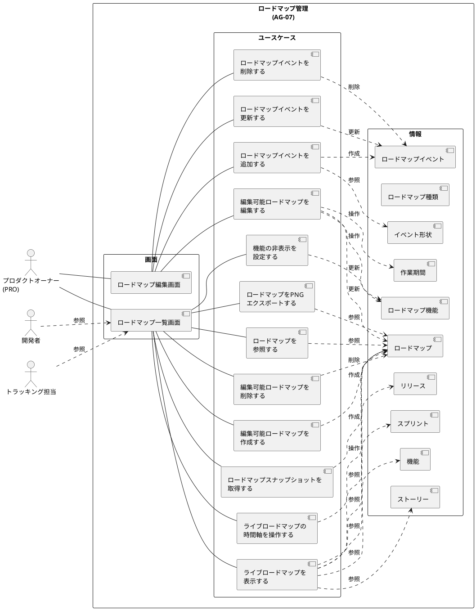

# UC複合図

ロードマップ管理業務領域（AG-07）のユースケース複合図をPlantUMLで定義します。

```plantuml
@startuml
left to right direction
skinparam packageStyle rectangle

actor "プロダクトオーナー\n(PRO)" as PO
actor "開発者" as Dev
actor "トラッキング担当" as Tracker

package "ロードマップ管理\n(AG-07)" {
  package "画面" {
    [ロードマップ一覧画面] as Screen1
    [ロードマップ編集画面] as Screen2
  }

  package "ユースケース" {
    [ライブロードマップを\n表示する] as UC1
    [ライブロードマップの\n時間軸を操作する] as UC2
    [ロードマップスナップショットを\n取得する] as UC3
    [編集可能ロードマップを\n作成する] as UC4
    [編集可能ロードマップを\n編集する] as UC5
    [編集可能ロードマップを\n削除する] as UC6
    [ロードマップイベントを\n追加する] as UC7
    [ロードマップイベントを\n更新する] as UC8
    [ロードマップイベントを\n削除する] as UC9
    [ロードマップを\n参照する] as UC10
    [ロードマップをPNG\nエクスポートする] as UC11
    [機能の非表示を\n設定する] as UC12
  }

  package "情報" {
    [ロードマップ] as RM
    [ロードマップ種類] as RMType
    [ロードマップ機能] as RMFeature
    [作業期間] as WorkPeriod
    [ロードマップイベント] as RMEvent
    [イベント形状] as EventShape
    [機能] as Feature
    [スプリント] as Sprint
    [リリース] as Release
    [ストーリー] as Story
  }

  PO -- Screen1
  PO -- Screen2
  Dev ..> Screen1 : 参照
  Tracker ..> Screen1 : 参照

  Screen1 -- UC1
  Screen1 -- UC2
  Screen1 -- UC3
  Screen1 -- UC4
  Screen1 -- UC6
  Screen1 -- UC10
  Screen1 -- UC11
  Screen1 -- UC12

  Screen2 -- UC5
  Screen2 -- UC7
  Screen2 -- UC8
  Screen2 -- UC9

  UC1 ..> RM : 参照
  UC1 ..> Feature : 参照
  UC1 ..> Sprint : 参照
  UC1 ..> Release : 参照
  UC1 ..> Story : 参照
  UC2 ..> RM : 操作
  UC3 ..> RM : 作成
  UC4 ..> RM : 作成
  UC5 ..> RM : 更新
  UC5 ..> WorkPeriod : 操作
  UC5 ..> RMFeature : 操作
  UC6 ..> RM : 削除
  UC7 ..> RMEvent : 作成
  UC7 ..> EventShape : 参照
  UC8 ..> RMEvent : 更新
  UC9 ..> RMEvent : 削除
  UC10 ..> RM : 参照
  UC11 ..> RM : 参照
  UC12 ..> RMFeature : 更新
}
@enduml
```
