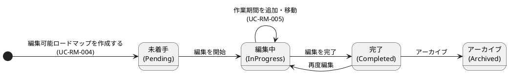
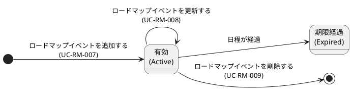

# ステートマシン図

ロードマップ管理業務領域（AG-07）の状態遷移図をPlantUMLで定義します。

## ロードマップの状態遷移

```plantuml
@startuml
left to right direction
state "未着手\n(Pending)" as Pending
state "編集中\n(InProgress)" as InProgress
state "完了\n(Completed)" as Completed
state "アーカイブ\n(Archived)" as Archived

[*] --> Pending : 編集可能ロードマップを作成する\n(UC-RM-004)
Pending --> InProgress : 編集を開始
InProgress --> Completed : 編集を完了
InProgress --> InProgress : 作業期間を追加・移動\n(UC-RM-005)
Completed --> InProgress : 再度編集
Completed --> Archived : アーカイブ
@enduml
```

## ロードマップイベントの状態遷移

```plantuml
@startuml
left to right direction
state "有効\n(Active)" as Active
state "期限経過\n(Expired)" as Expired

[*] --> Active : ロードマップイベントを追加する\n(UC-RM-007)
Active --> Active : ロードマップイベントを更新する\n(UC-RM-008)
Active --> Expired : 日程が経過
Active --> [*] : ロードマップイベントを削除する\n(UC-RM-009)
@enduml
```
