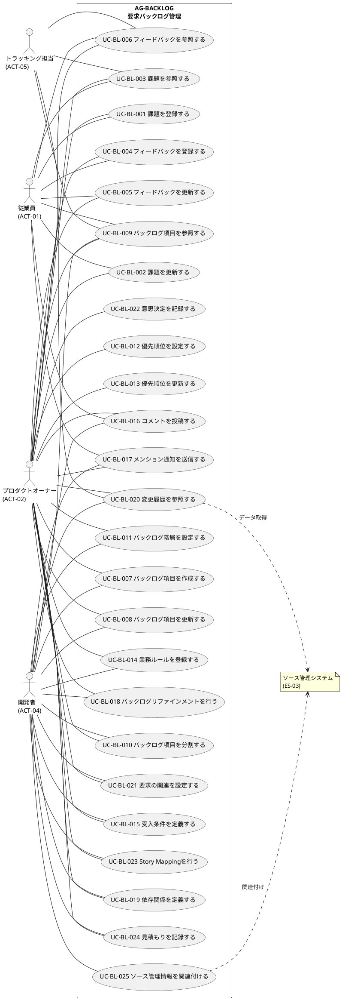

# ユースケース図

要求・プロダクトバックログ管理業務領域のユースケース図を示します。

```plantuml
@startuml
left to right direction

actor "従業員\n(ACT-01)" as employee
actor "プロダクトオーナー\n(ACT-02)" as po
actor "開発者\n(ACT-04)" as developer
actor "トラッキング担当\n(ACT-05)" as tracking

note "ソース管理システム\n(ES-03)" as es03

rectangle "AG-BACKLOG\n要求バックログ管理" {
  usecase "UC-BL-001 課題を登録する" as uc1
  usecase "UC-BL-002 課題を更新する" as uc2
  usecase "UC-BL-003 課題を参照する" as uc3
  usecase "UC-BL-004 フィードバックを登録する" as uc4
  usecase "UC-BL-005 フィードバックを更新する" as uc5
  usecase "UC-BL-006 フィードバックを参照する" as uc6
  usecase "UC-BL-007 バックログ項目を作成する" as uc7
  usecase "UC-BL-008 バックログ項目を更新する" as uc8
  usecase "UC-BL-009 バックログ項目を参照する" as uc9
  usecase "UC-BL-010 バックログ項目を分割する" as uc10
  usecase "UC-BL-011 バックログ階層を設定する" as uc11
  usecase "UC-BL-012 優先順位を設定する" as uc12
  usecase "UC-BL-013 優先順位を更新する" as uc13
  usecase "UC-BL-014 業務ルールを登録する" as uc14
  usecase "UC-BL-015 受入条件を定義する" as uc15
  usecase "UC-BL-016 コメントを投稿する" as uc16
  usecase "UC-BL-017 メンション通知を送信する" as uc17
  usecase "UC-BL-018 バックログリファインメントを行う" as uc18
  usecase "UC-BL-019 依存関係を定義する" as uc19
  usecase "UC-BL-020 変更履歴を参照する" as uc20
  usecase "UC-BL-021 要求の関連を設定する" as uc21
  usecase "UC-BL-022 意思決定を記録する" as uc22
  usecase "UC-BL-023 Story Mappingを行う" as uc23
  usecase "UC-BL-024 見積もりを記録する" as uc24
  usecase "UC-BL-025 ソース管理情報を関連付ける" as uc25
}

employee -- uc1
employee -- uc2
employee -- uc3
employee -- uc4
employee -- uc5
employee -- uc6
employee -- uc9
employee -- uc16
employee -- uc17

po -- uc1
po -- uc2
po -- uc3
po -- uc4
po -- uc5
po -- uc6
po -- uc7
po -- uc8
po -- uc9
po -- uc10
po -- uc11
po -- uc12
po -- uc13
po -- uc14
po -- uc15
po -- uc16
po -- uc17
po -- uc18
po -- uc19
po -- uc20
po -- uc21
po -- uc22
po -- uc23
po -- uc24

developer -- uc7
developer -- uc8
developer -- uc9
developer -- uc10
developer -- uc11
developer -- uc14
developer -- uc15
developer -- uc16
developer -- uc17
developer -- uc18
developer -- uc19
developer -- uc20
developer -- uc21
developer -- uc23
developer -- uc24
developer -- uc25

tracking -- uc3
tracking -- uc6
tracking -- uc9
tracking -- uc20

uc20 ..> es03 : データ取得
uc25 ..> es03 : 関連付け

@enduml
```

## 関連情報

- アクター: 従業員 (ACT-01)、プロダクトオーナー (ACT-02)、開発者 (ACT-04)、トラッキング担当 (ACT-05)
- 外部システム: ソース管理システム (ES-03)
- ユースケース数: 25
