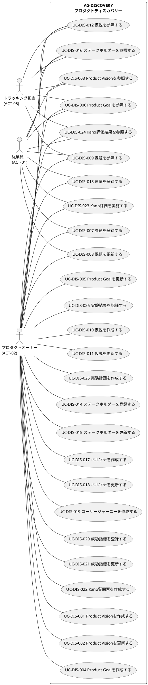

# ユースケース図

プロダクトディスカバリー業務領域のユースケース図を示します。

```plantuml
@startuml
left to right direction

actor "従業員\n(ACT-01)" as employee
actor "プロダクトオーナー\n(ACT-02)" as po
actor "トラッキング担当\n(ACT-05)" as tracking

rectangle "AG-DISCOVERY\nプロダクトディスカバリー" {
  usecase "UC-DIS-001 Product Visionを作成する" as uc1
  usecase "UC-DIS-002 Product Visionを更新する" as uc2
  usecase "UC-DIS-003 Product Visionを参照する" as uc3
  usecase "UC-DIS-004 Product Goalを作成する" as uc4
  usecase "UC-DIS-005 Product Goalを更新する" as uc5
  usecase "UC-DIS-006 Product Goalを参照する" as uc6
  usecase "UC-DIS-007 課題を登録する" as uc7
  usecase "UC-DIS-008 課題を更新する" as uc8
  usecase "UC-DIS-009 課題を参照する" as uc9
  usecase "UC-DIS-010 仮説を作成する" as uc10
  usecase "UC-DIS-011 仮説を更新する" as uc11
  usecase "UC-DIS-012 仮説を参照する" as uc12
  usecase "UC-DIS-013 要望を登録する" as uc13
  usecase "UC-DIS-014 ステークホルダーを登録する" as uc14
  usecase "UC-DIS-015 ステークホルダーを更新する" as uc15
  usecase "UC-DIS-016 ステークホルダーを参照する" as uc16
  usecase "UC-DIS-017 ペルソナを作成する" as uc17
  usecase "UC-DIS-018 ペルソナを更新する" as uc18
  usecase "UC-DIS-019 ユーザージャーニーを作成する" as uc19
  usecase "UC-DIS-020 成功指標を登録する" as uc20
  usecase "UC-DIS-021 成功指標を更新する" as uc21
  usecase "UC-DIS-022 Kano質問票を作成する" as uc22
  usecase "UC-DIS-023 Kano評価を実施する" as uc23
  usecase "UC-DIS-024 Kano評価結果を参照する" as uc24
  usecase "UC-DIS-025 実験計画を作成する" as uc25
  usecase "UC-DIS-026 実験結果を記録する" as uc26
}

employee -- uc3
employee -- uc6
employee -- uc9
employee -- uc12
employee -- uc16
employee -- uc24
employee -- uc7
employee -- uc8
employee -- uc13
employee -- uc23

po -- uc1
po -- uc2
po -- uc3
po -- uc4
po -- uc5
po -- uc6
po -- uc7
po -- uc8
po -- uc9
po -- uc10
po -- uc11
po -- uc12
po -- uc13
po -- uc14
po -- uc15
po -- uc16
po -- uc17
po -- uc18
po -- uc19
po -- uc20
po -- uc21
po -- uc22
po -- uc23
po -- uc24
po -- uc25
po -- uc26

tracking -- uc3
tracking -- uc6
tracking -- uc9
tracking -- uc12
tracking -- uc16
tracking -- uc24

@enduml
```

## 関連情報

- アクター: 従業員 (ACT-01)、プロダクトオーナー (ACT-02)、トラッキング担当 (ACT-05)
- 外部システム: なし
- ユースケース数: 26
