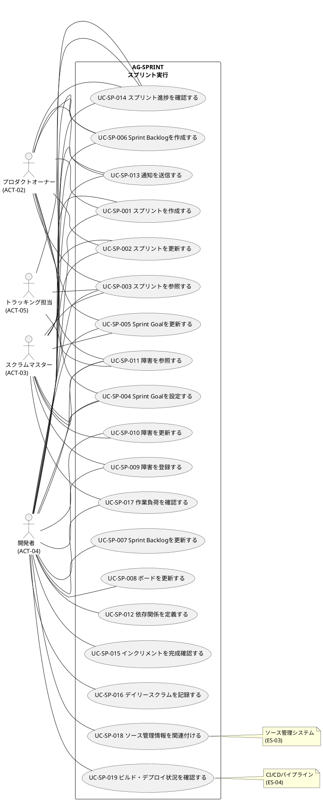

# ユースケース図

スプリント実行とインクリメント形成業務領域のユースケース図を示します。

```plantuml
@startuml
left to right direction

actor "プロダクトオーナー\n(ACT-02)" as po
actor "スクラムマスター\n(ACT-03)" as sm
actor "開発者\n(ACT-04)" as developer
actor "トラッキング担当\n(ACT-05)" as tracking

note "ソース管理システム\n(ES-03)" as es03
note "CI/CDパイプライン\n(ES-04)" as es04

rectangle "AG-SPRINT\nスプリント実行" {
  usecase "UC-SP-001 スプリントを作成する" as uc1
  usecase "UC-SP-002 スプリントを更新する" as uc2
  usecase "UC-SP-003 スプリントを参照する" as uc3
  usecase "UC-SP-004 Sprint Goalを設定する" as uc4
  usecase "UC-SP-005 Sprint Goalを更新する" as uc5
  usecase "UC-SP-006 Sprint Backlogを作成する" as uc6
  usecase "UC-SP-007 Sprint Backlogを更新する" as uc7
  usecase "UC-SP-008 ボードを更新する" as uc8
  usecase "UC-SP-009 障害を登録する" as uc9
  usecase "UC-SP-010 障害を更新する" as uc10
  usecase "UC-SP-011 障害を参照する" as uc11
  usecase "UC-SP-012 依存関係を定義する" as uc12
  usecase "UC-SP-013 通知を送信する" as uc13
  usecase "UC-SP-014 スプリント進捗を確認する" as uc14
  usecase "UC-SP-015 インクリメントを完成確認する" as uc15
  usecase "UC-SP-016 デイリースクラムを記録する" as uc16
  usecase "UC-SP-017 作業負荷を確認する" as uc17
  usecase "UC-SP-018 ソース管理情報を関連付ける" as uc18
  usecase "UC-SP-019 ビルド・デプロイ状況を確認する" as uc19
}

po -- uc1
po -- uc2
po -- uc3
po -- uc4
po -- uc5
po -- uc6
po -- uc11
po -- uc13
po -- uc14

sm -- uc1
sm -- uc2
sm -- uc3
sm -- uc4
sm -- uc5
sm -- uc6
sm -- uc9
sm -- uc10
sm -- uc11
sm -- uc13
sm -- uc14
sm -- uc17

developer -- uc1
developer -- uc2
developer -- uc3
developer -- uc4
developer -- uc5
developer -- uc6
developer -- uc7
developer -- uc8
developer -- uc9
developer -- uc10
developer -- uc11
developer -- uc12
developer -- uc13
developer -- uc14
developer -- uc15
developer -- uc16
developer -- uc17
developer -- uc18
developer -- uc19

tracking -- uc3
tracking -- uc11
tracking -- uc14

uc18 ..> es03 : 関連付け
uc19 ..> es04 : 状況取得

@enduml
```

## 関連情報

- アクター: プロダクトオーナー (ACT-02)、スクラムマスター (ACT-03)、開発者 (ACT-04)、トラッキング担当
  (ACT-05)
- 外部システム: ソース管理システム (ES-03)、CI/CDパイプライン (ES-04)
- ユースケース数: 19
