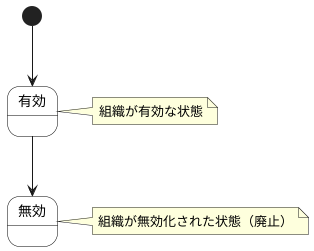

# 組織 ステートチャート

組織情報の状態遷移を示します。

```plantuml
@startuml
skinparam state {
  BackgroundColor White
  BorderColor Black
}

state "有効" as active
state "無効" as inactive

[*] --> active
active --> inactive

note right of active
  組織が有効な状態
end note

note right of inactive
  組織が無効化された状態（廃止）
end note
@enduml
```

## 状態一覧

| 状態ID | 状態名 | 説明 |
|--------|--------|------|
| ST-AS-ORG-001 | 有効 | 組織が有効な状態 |
| ST-AS-ORG-002 | 無効 | 組織が無効化された状態（廃止） |
