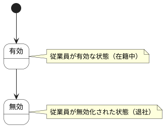

# 従業員 ステートチャート

従業員情報の状態遷移を示します。

```plantuml
@startuml
skinparam state {
  BackgroundColor White
  BorderColor Black
}

state "有効" as active
state "無効" as inactive

[*] --> active
active --> inactive

note right of active
  従業員が有効な状態（在籍中）
end note

note right of inactive
  従業員が無効化された状態（退社）
end note
@enduml
```

## 状態一覧

| 状態ID | 状態名 | 説明 |
|--------|--------|------|
| ST-AS-PERSON-001 | 有効 | 従業員が有効な状態（在籍中） |
| ST-AS-PERSON-002 | 無効 | 従業員が無効化された状態（退社） |
