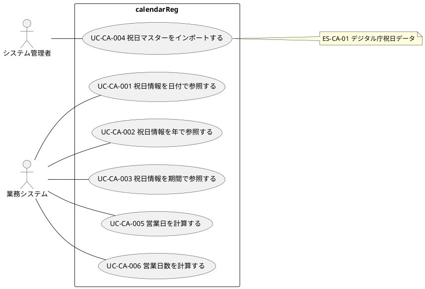

# ユースケース図

カレンダー管理（CA-01）のユースケース図を定義します。

## ユースケース図

```plantuml
@startuml
left to right direction

actor "システム管理者" as Admin
actor "業務システム" as BizSystem

rectangle "calendarReg" {
  usecase "UC-CA-001 祝日情報を日付で参照する" as UC01
  usecase "UC-CA-002 祝日情報を年で参照する" as UC02
  usecase "UC-CA-003 祝日情報を期間で参照する" as UC03
  usecase "UC-CA-004 祝日マスターをインポートする" as UC04
  usecase "UC-CA-005 営業日を計算する" as UC05
  usecase "UC-CA-006 営業日数を計算する" as UC06
}

note "ES-CA-01 デジタル庁祝日データ" as ES01

BizSystem -- UC01
BizSystem -- UC02
BizSystem -- UC03
BizSystem -- UC05
BizSystem -- UC06
Admin -- UC04

UC04 ..> ES01 : CSVデータ読み込み

@enduml
```

## 関連情報

- アクター: システム管理者、業務システム
- 外部システム: デジタル庁祝日データ
- ユースケース数: 6
