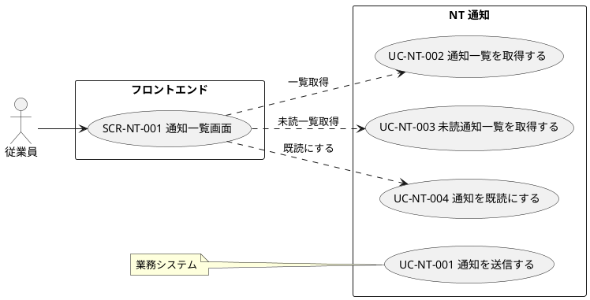

# ユースケース図

NT 通知モジュールのユースケース図を定義します。

## ユースケース図

```plantuml
@startuml
left to right direction

actor "従業員" as 従業員
note "業務システム" as 業務システム

rectangle "NT 通知" {
  usecase "UC-NT-001 通知を送信する" as UC_NT_001
  usecase "UC-NT-002 通知一覧を取得する" as UC_NT_002
  usecase "UC-NT-003 未読通知一覧を取得する" as UC_NT_003
  usecase "UC-NT-004 通知を既読にする" as UC_NT_004
}

rectangle "フロントエンド" {
  usecase "SCR-NT-001 通知一覧画面" as SCR_NT_001
}

業務システム --> UC_NT_001

従業員 --> SCR_NT_001
SCR_NT_001 ..> UC_NT_002 : 一覧取得
SCR_NT_001 ..> UC_NT_003 : 未読一覧取得
SCR_NT_001 ..> UC_NT_004 : 既読にする

@enduml
```

## 関連情報

- アクター: 従業員、業務システム
- 外部システム: なし
- ユースケース数: 4
