# 第10章 アーキテクチャ全般・ライブラリなど

本章では、アーキテクチャ全般にまたがる話題や、その他ライブラリ、フレームワーク、言語、ツールといった話題について解説します。

本章の内容は、他の章に比べて言語の影響を受けやすいものになります。ここではJava前提での解説を行うため、異なる言語で適用する場合は適宜読み替えが必要になります、ご了承ください。

## 10.1 例外処理

例外処理の方針は言語によって大きく異なります。検査例外がない、例外ではなくEitherなどで処理を行うのが通常といった言語の場合は、基本的な発想のみ参考に読み替えてください。

また、例外を使っての処理方針はさまざまな考え方があるため、ここで紹介する方針は一例として参考にしてください。

### 10.1.1 例外の種類

例外は大きく以下の2種類に分けることができます。

* 想定外の例外
* 通常のユースケースで発生しうる例外

例外処理は、この種類に応じて方針を切り分けることが重要です。

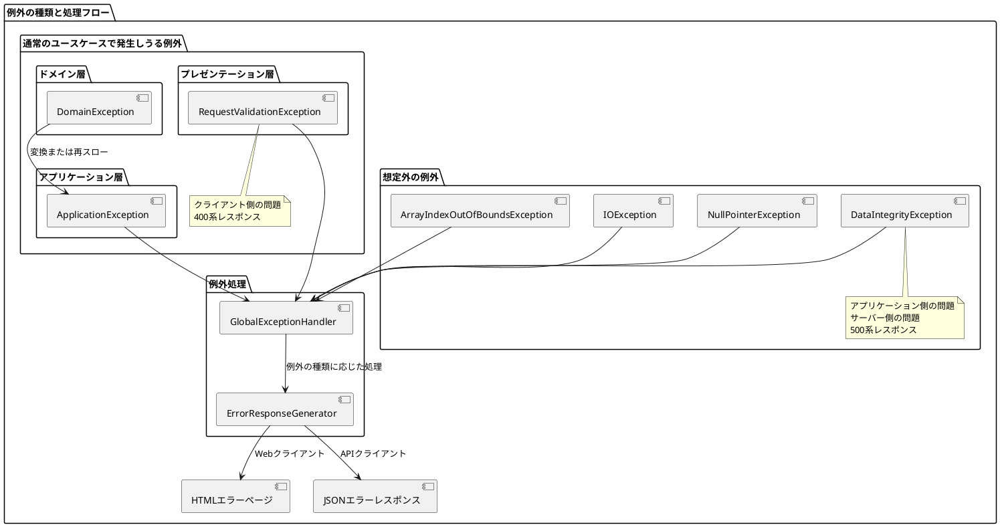

#### 想定外の例外

サーバー側の問題で、500系のレスポンスを返すような場合です。

代表的なものとしては、メソッド呼び出しの前提条件を満たさない場合のエラーがあります。not
nullと定義されている引数にnullを渡してしまった場合や、配列で存在しないインデックスを指定して取得した場合などが挙げられます。

他にも、外部リソース[^1]との入出力で、接続エラーや値の読み込みエラーといったものも一般的です。

また、データの整合性が想定外に崩れている場合(
データAがあればBがあるはずなのに、取得したら結果が0件といったケース)も、アプリケーション側の問題なのでこちらに該当します。

このような例外が発生した場合、ユーザーは通常ユースケースとしての回避策がないため、内部エラー時の共通のレスポンスを返すことになります。

実装方法としては、非検査例外を投げ、プレゼンテーション層の共通クラスで一律キャッチします。キャッチした共通クラスにおける返し方はクライアントの種類によって変わります。共通のエラーページのHTMLを返すか、エラー用のJSONレスポンスを返すのが良いでしょう。

#### 通常のユースケースで発生しうる例外

こちらは、クライアント側の問題で、400系のレスポンスを返すような場合です。いわゆるバリデーションでエラーだった場合などです。注意しなければいけないのは、内容に応じてその例外を投げるレイヤーは異なるということです。それぞれのレイヤーの責務に応じたバリデーションを行い、異常があればそのレイヤーで定義している例外を投げます。

まず、プレゼンテーション層が例外を投げるのは、API仕様としてリクエストパラメーターの必須/任意や最大文字数などの制限を公開しており、リクエストがその条件を満たさなかった場合です。その仕様を定義しているプレゼンテーション層でチェックし、例外を投げます。(
もしくは例外を使わずエラーレスポンスを返します)

ドメイン層では、ドメイン知識(ルール/制約)をチェックし、違反した際にドメイン層で定義する例外を投げます。この場合、アプリケーション層はドメイン層から投げられた例外

[^1]: DB、ファイル、外部サービスなど
を受け、呼び出し元にどう返すかの判断を行います。ドメイン層の例外に対してそのままエラーで処理を終えるのか、代わりに別の処理を行うのかはユースケースの問題です。その判断を委ねるために、ドメイン層の例外は検査例外とします。

アプリケーション層では、あらかじめ想定する異常系の処理パターンだった時に、アプリケーション層で定義する例外を投げます。アプリケーションサービス内の分岐で例外を投げる場合と、前述の通り、ドメイン層の例外をキャッチしてアプリケーション層の例外に詰め替えて投げる場合があります。

例外がアプリケーション層のものかという判断は若干迷いやすいので、プレゼンテーション層にもドメイン層にも該当しなければこちら、といった消去法的な判断をしても良いでしょう。

```plantuml
@startuml
package "レイヤー別の例外処理" {
  package "プレゼンテーション層" {
    [Controller] as C
    [RequestValidator] as RV
    [GlobalExceptionHandler] as GEH

    RV --> [RequestValidationException] as RVE: 投げる
    C --> RV: 使用
  }

  package "アプリケーション層" {
    [ApplicationService] as AS

    AS --> [ApplicationException] as AE: 投げる
  }

  package "ドメイン層" {
    [DomainModel] as DM

    DM --> [DomainException] as DE: 投げる
  }

  C --> AS: 呼び出し
  AS --> DM: 操作

  DE --> AS: キャッチ
  AS --> AE: 変換して再スロー

  RVE --> GEH: キャッチ
  AE --> GEH: キャッチ

  note right of RVE
    API仕様に関する
    バリデーションエラー
  end note

  note right of DE
    ドメインルール違反
    検査例外として定義
  end note

  note right of AE
    アプリケーション層の
    ビジネスルール違反
    または
    ドメイン例外の変換
  end note
}
@enduml
```

### 10.1.2 バリデーション内容の重複

ドメイン層とプレゼンテーション層などで、同じ内容のバリデーションをしたくなる場合があります。この場合、メリットデメリットが一長一短な選択肢があるので、その観点を整理します。

まず、ドメインのルール/制約は重要で、確実に守りたいものです。ドメイン層にこのバリデーションがない場合、「ある処理ではバリデーションされたが、別の処理ではバリデーションを忘れた」ということが発生すると、データの整合性が保証できなくなります。これを回避するためには、ドメイン層のロジックとして実装し、それ以外の層からは整合性を破壊できないようにします。このバリデーションは、他の層のものよりも優先する方が良いでしょう。

一方、同じ内容のバリデーションをプレゼンテーション層で実装したい場合があります。考えられるケースは、APIの仕様として外部にリクエストの仕様を公開する場合です。APIの仕様としてドキュメントがある場合、それはプレゼンテーション層の責務としてプレゼンテーション層で管理したくなります。特に、APIドキュメントからコントローラーを自動生成する場合には、自ずとこのバリデーションがプレゼンテーション層に実装されます。

プレゼンテーション層にバリデーションを実装する場合、プレゼンテーション層でルールを明示的に管理できるメリットと、同じ内容のバリデーションがドメイン層と重複し、仕様変更時に修正が漏れるリスクが発生する、というデメリットがあります。

また、UX向上のために同じ内容のバリデーションをフロントエンドモジュールに書くこともあります。サーバー通信せず、キー入力のタイミングでバリデーションをかける場合などです。この場合も同様に、実装の重複による修正漏れリスクがあります。

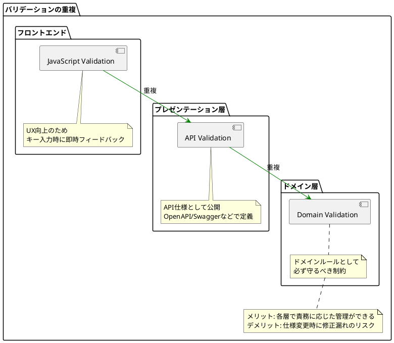

これらのメリットデメリットは一長一短なため、一概にどちらが良いとは決められません。各プロジェクトにおいて、重視するポイントを考慮して決定することになります。

### 10.1.3 処理結果を例外で表現しない場合

例外を使用する場合は、例外が投げられればメソッド内の処理が失敗、投げられなければ成功という判断を行います。一方、この表現をSuccess、Failといった結果を表すオブジェクトを返す方針もあります。

メリットとしては、前述のような例外の使用が一般的でない言語やフレームワークを使用している時に適用しやすいことです。デメリットとしては、チェックのたびに分岐してreturnしなければいけないため、例外を使用する場合に比べて呼び出し元の記述が煩雑になることです。

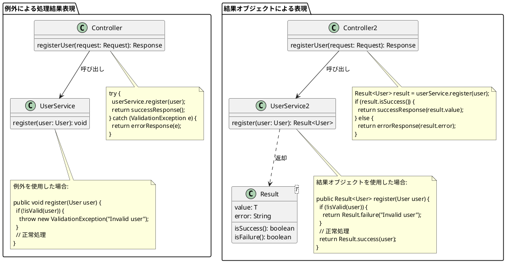

## 10.2 パッケージ

### 全体のパッケージ構成

パッケージングについては、レイヤーをパッケージのルートの階層で分けるのが良いでしょう。設計する上で一番初めに考えるべきなのは、設計対象の処理がどのレイヤーの責務に属するかということであり、それをパッケージで明確に意識しやすくするためです。

```plantuml
@startuml
package "com.example.application" {
  package "presentation" {
    package "controller" {
      [TaskController]
      [UserController]
    }
    package "request" {
      [TaskRequest]
      [UserRequest]
    }
    package "response" {
      [TaskResponse]
      [UserResponse]
    }
    package "shared" {
      [DateFormatter]
      [ResponseBuilder]
    }
  }

  package "application" {
    package "service" {
      [TaskService]
      [UserService]
    }
    package "dto" {
      [TaskDto]
      [UserDto]
    }
    package "shared" {
      [TransactionHelper]
    }
  }

  package "domain" {
    package "model" {
      package "task" {
        [Task]
        [TaskId]
        [TaskStatus]
        [TaskRepository]
      }
      package "user" {
        [User]
        [UserId]
        [UserRepository]
      }
    }
    package "shared" {
      [BusinessDate]
      [Money]
    }
  }

  package "infrastructure" {
    package "repository" {
      [TaskRepositoryImpl]
      [UserRepositoryImpl]
    }
    package "datasource" {
      [JdbcConfig]
      [ConnectionPool]
    }
    package "shared" {
      [JdbcTemplate]
    }
  }

  package "config" {
    [ApplicationConfig]
    [SecurityConfig]
  }
}

note bottom of "presentation"
  プレゼンテーション層
  クライアントとの入出力を担当
end note

note bottom of "application"
  アプリケーション層
  ユースケースを実現
end note

note bottom of "domain"
  ドメイン層
  ビジネスルールを表現
end note

note bottom of "infrastructure"
  インフラ層
  技術的関心事を実装
end note

note bottom of "config"
  アプリケーション全体の設定
  どのレイヤーにも属さない
end note
@enduml
```

そのパッケージ以下は、処理のカテゴリや、集約ごとに分けていきましょう。ドメイン層は特に、集約ごとにパッケージを分けて関わりのあるオブジェクトを表現すること、(
Javaの場合は)パッケージプライベートの可視性を有効利用することが非常に重要です。集約をパッケージで表現できたら、複数の集約パッケージを意味的なまとまりでパッケージで整理しても良いでしょう。

### 共有されるオブジェクトのパッケージ

複数の箇所で使用するオブジェクトは、該当するレイヤーのパッケージ以下に「shared」などの意図が明確な名前のパッケージを作り、そこにまとめます。

配置するレイヤーをきちんと検討した上で決定することは重要です。例えば、日付を扱う処理に関して、業務的に意味のある日付を処理するオブジェクトであればそれはドメイン層に属するものであり、表示時の日付のフォーマットを変換するオブジェクトであればプレゼンテーション層に属するものとなります。レイヤーを意識せずに共有オブジェクトを作成すると、責務が曖昧で凝集度が低く、保守性が低いものになる可能性が高くなります。

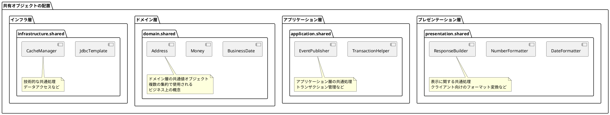

一部アプリケーション起動に必要なオブジェクトなど、レイヤーの概念に当てはまらないものも発生しますが、どこかのレイヤーに該当しないかしっかりと検討した上で、他のレイヤーと並列で配置するなどの判断を行います。

## 10.3 Webフレームワークへの依存

Webフレームワークには、どの程度まで依存を許容するのでしょうか。

特定のWebフレームワークに依存して移行に苦労した経験から、一切依存を除外したい、という意見があります。しかし、すべてのレイヤーにおいて完全に依存を排除するのは難しく、レイヤーごとにポリシーを決めるのが現実的です。以下、レイヤーごとに確認していきましょう。

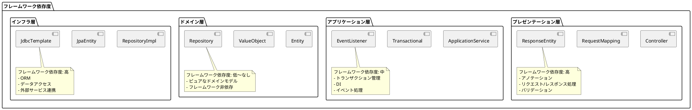

### ドメイン層

ドメイン層では、一切依存しない形にするのが望ましいです。

一部、ドメインサービス内でリポジトリなど他のインスタンスを使用する場合、Dependency Injection(以下、DI)
が必要になる場合があります。これに関しては、DIなしで自分でインスタンス管理をする場合に比べて、コストより得るものが大きいので、DIライブラリへの依存は許容範囲と考えても良いでしょう。DIはコンストラクタインジェクション[^2]
であれば必要な記述はコンストラクタとアノテーション程度となり、ロジック詳細には影響せずに済むことが多いです。

### アプリケーション層

アプリケーション層では、部分的な依存は必要になります。

DIに関しては、ドメイン層以上に必要になりますが、ドメイン層と同じ理由で許容範囲と考えられます。

トランザクションに関しては、使用するフレームワークによって記述方法が大きく変わりますが、ここはアプリケーション層で意識せざるを得ません。AOP[^3]
の利用や共通クラスに処理を寄せるなど、極力個別のアプリケーションサービスメソッドに意識させないようにするなどの工夫ができると望ましいです。

ロギングに関してはどうでしょうか。明示的にログを吐く場合、アプリケーション層にロガーのインターフェイスを定義し、実装クラスをインフラ層に配置するようにすれば、アプリケーション層が特定のロギングライブラリに依存することは避けられます。

### プレゼンテーション層

こちらの層では、「第9章プレゼンテーション層の実装」で述べた通り、リクエストを受け取ってアプリケーションコードに引き渡す処理など、必然的にフレームワーク固有の実装が大変多くなりますが、これは責務上仕方ないことです。むしろ、フレームワーク固有の実装を極力このレイヤーに閉じ込めることが重要です。

[^2]: https://ja.wikipedia.org/wiki/依存性の注入

[^3]: https://docs.spring.io/spring/docs/2.5.x/reference/aop.html

## 10.4 ORマッパー

ORマッパーとは、どう付き合うのが良いでしょうか。代表的なものがActive
Record型の、テーブルと対応したクラスです。これらのクラスをドメイン層のクラスとしてそのまま使ってはいけません。

そのまま使う場合、以下のような大きなデメリットがあります。

* すべての項目にセッターがあるため、更新処理に制御をかけられなくなる
*

テーブルとオブジェクトが切り離せなくなるため、オブジェクトとテーブルの設計に望ましくない制約がかかってしまう(
詳細は次節にて説明)

そのため、Active
Record型のテーブルに対応したクラスはインフラ層のリポジトリ実装クラス内に閉じ込め、DBデータを取得した結果をドメイン層のクラスに詰め替える形にします。こうすることで、ドメイン層、アプリケーション層が特定のORマッパーの知識を持たせないように隠蔽できます。

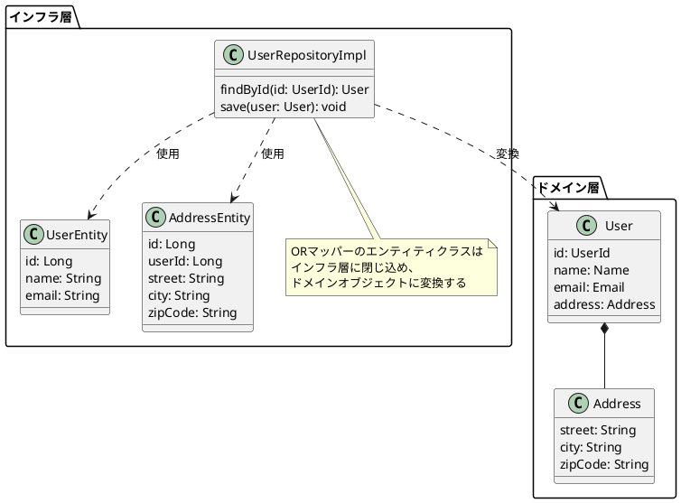

### オブジェクトとテーブルが分離できないことによる制約

前節で述べた「望ましくない制約」とはどういうことでしょうか、具体例で解説します。

ユーザーと住所が同じ集約で、ユーザーが住所をインスタンス参照するとします。この関係をドメインモデル図で表すと、以下のようになります。

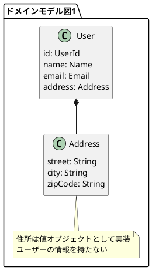

この場合、住所はユーザーの情報を持たない値オブジェクトとして実装し、ユーザーが住所オブジェクトをメンバー変数として保持します。

これをテーブルに永続化する際は、ER図は以下のような形になります。

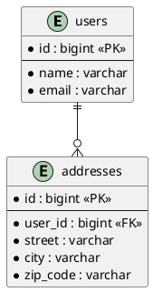

テーブルの場合は住所からユーザーに、IDの参照を持ちます。ここで、オブジェクトとテーブルでは参照の向きが逆向きになっているのです。

さて、ここでテーブルとオブジェクトが分離できない場合どうなるでしょうか。住所オブジェクトがユーザーへの参照を持たなければいけない、という制約が発生するのです。

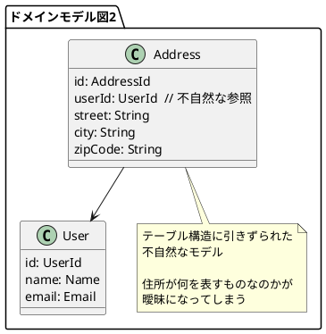

「住所」というものを表現するオブジェクトを作成する時に、ユーザーIDを渡すというのは意味が成り立たず、住所オブジェクトが何を表すものなのかが曖昧になってしまいました。これが「望ましくない制約がかかる」ということの一例になります。

このような制約と妥協が積み重なっていくと、せっかく作成したドメインモデル図と、実装がどんどん乖離していきます。それでは1章で解説したDDDのアプローチが取れなくなり、ソフトウェア価値を高めることの妨げになるのです。

ドメイン層のモデルはどこにも依存せず、制約を受けない形での実装にすることが非常に重要です。

## 10.5 言語

DDDを実装する際の言語について、向き不向きはあるでしょうか。

向いている条件として、静的型付け言語であることです。DDDでは、モデルのルール/制約をオブジェクト指向の型で表現します。動的型付け言語の場合、表現した制約を容易に破れてしまうため、効果を十分に得にくいです。ただし、動的型付け言語の場合でも、タイプヒントと静的解析の組み合わせで補完することはできます。

この条件を考えると、Java、Scalaは向いている、Python、PHP、JavaScriptでもできる、Rubyは現時点では不向き、ということが言えるでしょう。

```plantuml
@startuml
scale 0.8
skinparam backgroundColor transparent

!define GOOD_COLOR #AAFFAA
!define MEDIUM_COLOR #FFFFAA
!define BAD_COLOR #FFAAAA

rectangle "静的型付け言語" as static_typed #GOOD_COLOR {
  rectangle "Java" as java
  rectangle "Scala" as scala
  rectangle "TypeScript" as typescript
  rectangle "C#" as csharp
  rectangle "Kotlin" as kotlin
  rectangle "Go" as go
  rectangle "Rust" as rust
}

rectangle "動的型付け言語\n(型ヒント・静的解析あり)" as dynamic_typed_with_hints #MEDIUM_COLOR {
  rectangle "Python" as python
  rectangle "PHP" as php
  rectangle "JavaScript" as javascript
}

rectangle "動的型付け言語\n(型ヒント・静的解析なし)" as dynamic_typed_without_hints #BAD_COLOR {
  rectangle "Ruby" as ruby
}

note bottom of static_typed
  DDDに最適
  - 型による制約の表現
  - コンパイル時の型チェック
  - IDEのサポート
end note

note bottom of dynamic_typed_with_hints
  DDDに対応可能
  - 型ヒントによる制約の表現
  - 静的解析ツールによる型チェック
  - 実行時には制約が破られる可能性あり
end note

note bottom of dynamic_typed_without_hints
  DDDに不向き
  - 型による制約の表現が難しい
  - 実行時まで型エラーが検出されない
  - 意図しない使用を防ぎにくい
end note
@enduml
```

## 10.6 Q&A

### 10.6.1 アーキテクチャの部分適用

*

*

重要な箇所だけDDDにしようと思っていたところ、他のメンバーに「どこが重要なのかの判断がまちまちになるので、全部クリーンアーキテクチャにすべき」と言われました。全部やり出したところやはり手間がものすごくかかり、DBから単純にレコードを返すようなAPIまでクリーンアーキテクチャにする必要はないのではと思うのですが、どう思いますか？
**

部分適用する場合、適用する基準を明文化することが必要です。基準なく担当者個別で判断をすると、あとあと収集がつかなくなります。

基準が明確化され、それぞれの場合の実装がうまく切り分けられそうであれば、部分適用することは良いでしょう。具体的には、特定の業務に関わるものであるとか、特定のタイミング以降に作るものといった基準が考えられます。

ただし、実装をうまく切り分ける、ということが結構難しいので、そこが解決できなければ全適用、という判断もありです。

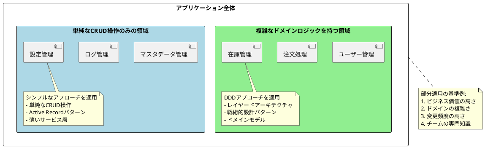
