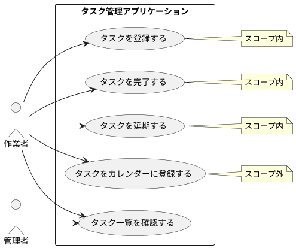
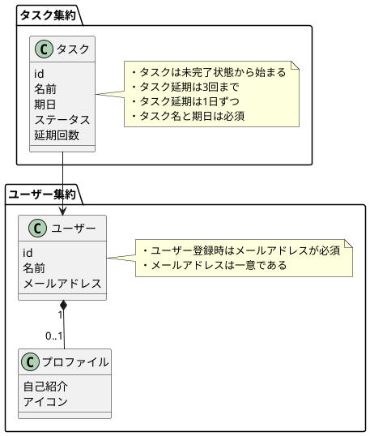
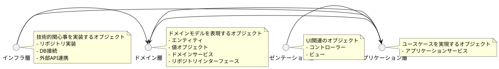
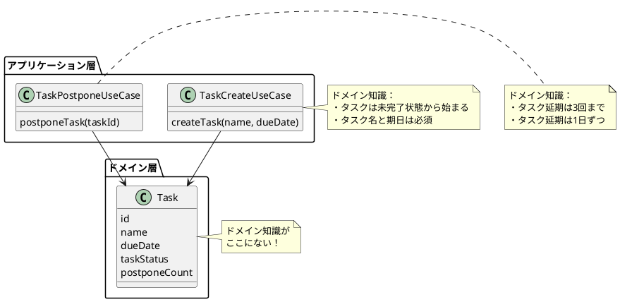
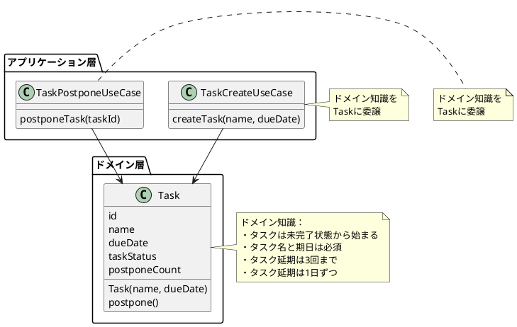

# 第2章 モデリングから実装まで

本章では、ドメインモデリングを行い、実装に落とすところまでを一通り解説します。DDDを用いた開発プロセス全体と、その効果を理解することを目指します。

## 2.1 ドメインモデリング

DDDに着手して迷うのは、モデリングの方法やアウトプットの形式です。エヴァンス本や実践DDDではそれが具体的に指定されておらず、初学者がつまずく要因の一つになっています。

DDDと相性が良いとされているモデリングの手法としてはRDRA(リレーションシップ駆動要件分析)[^1]
やICONIX[^2]といったものがあります。これらは有効な手法ですが、作成する図の種類が多く、着手するには少しハードルがあります。

本書では、比較的シンプルで、小さく初めて効果を出しやすい方法として、ユースケース図とドメインモデル図を作成する方法を紹介します。

### 2.1.1 ユースケース図

ユースケース図は、UMLで定義されているもので、「ユーザの要求に対するシステムの振る舞いを定義する図」です。アクターとしてユーザーの種類を定義(
棒人間のアイコンで記載)し、ユースケースとして「〇〇を××する」という形式でシステムの振る舞いを定義(
丸い吹き出しで記載)します。

例として、タスク管理アプリケーションを考えます。以下のようなユースケース図を作成しました。



このタイミングで、次ステップのドメインモデル図作成のスコープを決めます。今回は、タスクの登録や完了をスコープに入れ、カレンダー登録はスコープ外としました。

#### ユースケース図を作成する目的

なぜ、ドメインモデル図の前にユースケース図を作成するのでしょうか。それは、ユースケースを具体化しないと、どのようなモデルを作れば良いか判断できないからです。「作業者として、自分のタスクを管理したい」のか、「管理者として、複数作業者のタスク状況を管理したい」のか。それによって「タスク」のドメインモデルは違うものになります。

言い換えると、ユースケースが具体化されないと、モデルが解決するべき問題が明確にならないため、モデルの良し悪しも判断できないということになります。

#### ドメインモデル図作成のスコープを決める目的

なぜ、一度定義したユースケース図の中で、ドメインモデル図作成のスコープを定義するのでしょうか。

それは、ドメインモデル図を作成していると自然と色々な要素が思い浮かんでくるので、議論の範囲を狭めて限られた時間で成果を出せるようにするためです。議論が広がり過ぎてしまった時に「今回はここはスコープ外だから別の機会にしよう」と保留することができます。

ドメインモデル図作成中にスコープを狭め過ぎてしまったことに気付いたら、後から広げても構いません。その場合は、ユースケース図上のスコープも広げて同期させると良いでしょう。

### 2.1.2 ドメインモデル図

ドメインモデル図は、簡易化したクラス図のようなものです。

* オブジェクトの代表的な属性を書くが、メソッドまで書かなくてよい
* 「ルール/制約(ドメイン知識)」を吹き出しに書き出す
* オブジェクト同士の関連を示す
* 多重度を定義する
* 集約の範囲を定義する
* 理解を促進するために、具体例などを書いても良い

以上のルールに基づき、ドメインモデルを作成していきます。ルール/制約というのは、オブジェクトの生成や更新時に守らなければいけないルールを指します。

集約に関しては「第3章3.1
集約」で解説するので、最初は「このタイミングで集約まで設計する」ということだけ覚えておいてもらえれば大丈夫です。この段階で集約まで定義すると、リポジトリを作成する単位など、実装が具体的に決定できます。

なお、ユースケース図もドメインモデル図も、最初に作成するときはホワイトボードで殴り書きで構いません。複数人で議論しながら進めるには、ホワイトボードで書いたり消したりしながら進める方が意見を反映しやすいでしょう。

先ほどのユースケース図を元に、ドメインモデル図を作成しました。



オブジェクトとしてはタスクとユーザーがあり、1ユーザーに対して0～n個のタスクを持ちうることがわかります。また、ユーザー、タスクの作成や更新時のルールが吹き出しで書かれています。

#### ルール/制約の記述方法

ルール/制約は、基本的には吹き出しで箇条書きで書いていきます。ただし、他により良い書き方があれば、別の方法で記述しても構いません。

代表的なものが状態遷移図です。状態遷移もルール/制約の一つと捉えることができますが、文章で書くよりも図で表現した方がわかりやすいことがあります。そのような場合、ドメインモデル図と合わせて状態遷移図を書くことも可能です。

ルール/制約について関係者の認識を合わせ、新しい発見ができるのであれば、記述方法は自由に工夫していただいて構いません。

#### 集約の表現方法

集約を考慮する際、オブジェクト同士の関連は集約の内外で2種類に分かれます。その際、ドメインモデル図の記法としても次のように書き分けると良いでしょう。

* 集約内の参照はインスタンス参照となり、「◆－」で表す
* 集約外の参照はID参照となり、「→」で表す

上記の図では、ユーザーからプロファイルへの参照は集約内の参照であり、タスクからユーザーへの参照は集約外の参照となり、この記法に従っています。

## 2.2 ドメインモデルの実装

この節では、前節で作成したモデルをコードに落としていきます。

改善効果を実感しやすいように、改善余地が大きくあるドメインモデル貧血症のコードから始め、それをDDDの戦術的設計パターンを使ってリファクタリングしていく様子を解説します。ドメインモデル貧血症とは、ドメインモデルを実装するためのオブジェクトでありながら、ドメイン知識をほぼ持たないオブジェクトのことです。

サンプルコードはJavaを使います。また、ゲッター、セッターの生成にライブラリとしてLombok[^3]
を用います。@Getterアノテーションをクラスに対して記述すると、そのクラスのすべての属性にゲッターメソッドが生成されます。@Setterも同様です。

Webアプリケーションを想定しており、フレームワークとしてSpringを使用しています。@Autowiredを付けた属性は、DI(
Dependency Injection)コンテナにより必要なインスタンスがインジェクションされます[^4]
。また、@Transactionalを付けたメソッドでトランザクション管理が行われます[^5]。

### 2.2.1 アーキテクチャ

実装を始めるにあたり、全体のアーキテクチャを決定します。レイヤーを定義して「このレイヤーにはこういうクラスを実装する」という方針を定義します。ここではオニオンアーキテクチャというアーキテクチャを採用します。詳細は「第5章アーキテクチャ」にて解説します。



この節では、アプリケーション層とドメイン層のオブジェクトを実装します。

### 2.2.2 ドメインモデル貧血症のコード

リファクタリング前の改善余地があるコードの事例として、Taskクラスを見てみましょう。このクラスはドメイン層のオブジェクトです。

```java
// リスト2.1 Task.java バージョン1
@Setter
@Getter
public class Task {

  private Long id;
  private TaskStatus taskStatus;
  private String name;
  private LocalDate dueDate;
  private int postponeCount;
}
```

この段階では属性の定義のみで、ドメイン知識(ルール/制約)を持っていません。故にドメインモデル貧血症と呼ばれます。

このクラスを用いて、アプリケーション層のクラスでタスク登録時の処理を書きます。

```java
// リスト2.2 TaskCreateUseCase.java バージョン1
public class TaskCreateUseCase {

  @Autowired
  private TaskRepository taskRepository;

  public void createTask(String name, LocalDate dueDate) {
    if (name == null || dueDate == null) {
      throw new IllegalArgumentException("必須項目が設定されていません");
    }
    Task task = new Task();
    task.setTaskStatus(TaskStatus.UNDONE); // ①
    task.setName(name);
    task.setDueDate(dueDate);
    task.setPostponeCount(0); // ②
    taskRepository.save(task);
  }
}
```

①で「タスクは未完了状態から始まる」というドメイン知識を実装しています。また、「3回まで延期できる」というドメイン知識を表現するために、②で延期回数の初期状態を0に設定しています。

延期時の処理も同様に実装します。

```java
// リスト2.3 TaskPostponeUseCase.java バージョン1
public class TaskPostponeUseCase {

  @Autowired
  private TaskRepository taskRepository;
  private static int POSTPONE_MAX_COUNT = 3; // ③

  public void postponeTask(Long taskId) {
    Task task = taskRepository.findById(taskId);
    if (task.getPostponeCount() >= POSTPONE_MAX_COUNT) { // ④
      throw new IllegalArgumentException("最大延期回数を超過しています");
    }
    task.setDueDate(task.getDueDate().plusDays(1L)); // ⑥
    task.setPostponeCount(task.getPostponeCount() + 1); // ⑤
    taskRepository.save(task);
  }
}
```

「タスク延期は3回まで」というドメイン知識を③④⑤の実装で、「タスク延期は1日ずつ」というドメイン知識を⑥の実装で表現しています。

### 2.2.3 ドメインモデル貧血症のコードの問題点

この実装は、Active Record型[^6]のORマッパーを使った際によく見られる、一般的なものです。これで何が問題になるでしょうか？

#### 問題点1: 不整合なデータをいくらでも作れる

すべての属性のセッターがpublicになっているため、他のUseCaseクラスで自由に不整合なデータを作ることができてしまいます。

```java
// リスト2.4 不整合なデータを作成するクラス
public class EvilTaskUseCase {

  @Autowired
  private TaskRepository taskRepository;

  public void createDoneTask(String name, LocalDate dueDate) {
    Task task = new Task();
    task.setTaskStatus(TaskStatus.DONE); // × 完了状態でタスク生成
    task.setPostponeCount(-1); // × カウントがまさかのマイナス
    taskRepository.save(task);
  }

  public void changeTask(Long taskId,
      LocalDate dueDate,
      TaskStatus taskStatus) {
    Task task = taskRepository.findById(taskId);
    task.setDueDate(dueDate); // × 勝手に期日を入力値で設定、延期回数も無視
    task.setTaskStatus(taskStatus); // × タスクを未完了に戻せてしまう
    taskRepository.save(task);
  }
}
```

厄介なことに、リスト2.2、リスト2.3の正しい処理を行っているクラスをみていても、不整合な処理が追加されたことに気付けません。最悪の場合、不整合なデータが本番のDBに登録されて初めて発覚し、「このデータはどこで作られた？」となります。

不用意にすべての属性にpublicなセッターを作ることは、このような問題を引き起こすのです。

#### 問題点2: 仕様を追いかけるのに、多くのクラスをコード参照から追う必要がある

リスト2.1のTaskクラスのステータスや期日を変更する操作は、どのようなパターンがあるでしょうか。存在するパターンに、不整合なデータを生み出すパターンはないでしょうか。このようなことを調査したければ、Taskクラスのセッターメソッドの参照元を一つ一つ追っていく必要があります。このサンプルではシンプルですが、参照元が10個、20個もあったらどうでしょうか。すべての参照元を辿るのには時間がかかりますし、漏れも発生します。

コードの参照元が増えれば増えるほど、コードを辿っていくコストが高くなり、コードからモデルを理解することは難しくなっていきます。理解が難しいものは、バグを埋め込んでしまうリスクも高くなります。

### 2.2.4 ドメインモデルの知識を表現した実装

では、ドメインモデル貧血症の問題を、どのように解決していけば良いのでしょうか。それは、ドメインモデル図に示したドメイン知識を、吹き出しが書かれているオブジェクトに寄せていくのです。

#### ドメイン知識はどの層のオブジェクトに書かれているか

ドメインモデル図で吹き出しに書かれているドメイン知識は、どこのクラスに実装されているでしょうか？アーキテクチャの図にマッピングして見ましょう。



アプリケーション層のクラスである、リスト2.2、リスト2.3のUseCaseクラスに実装されていることがわかります。

ここから、ドメイン知識をドメイン層のクラスに委譲する形でリファクタリングしていきます。



#### ドメイン知識をドメイン層に委譲した実装

ドメイン知識をドメイン層のクラスに寄せると、どのような実装になるでしょうか。違いをわかりやすくするために、まずはアプリケーション層のクラスからみてみます。

```java
// リスト2.5 TaskCreateUseCase.java バージョン2
public class TaskCreateUseCase {

  @Autowired
  private TaskRepository taskRepository;

  @Transactional
  public void createTask(String name, LocalDate dueDate) {
    // 生成時のルール/制約に関する実装がなくなっている
    Task task = new Task(name, dueDate);
    taskRepository.save(task);
  }
}
```

```java
// リスト2.6 TaskPostponeUseCase.java バージョン2
public class TaskPostponeUseCase {

  @Autowired
  private TaskRepository taskRepository;

  @Transactional
  public void postpone(Long taskId) {
    // 更新時のルール/制約に関する実装がなくなっている
    Task task = taskRepository.findById(taskId);
    task.postpone();
    taskRepository.save(task);
  }
}
```

ドメイン知識を表現する実装を全く持たなくなりました。

結果として、修正前に比べてコード量が大幅に減り、ユースケース記述のような抽象度の高い記述になりました。「実装上どのように実現するか(
How)」は隠蔽され、「何をしたいか(What)」だけを示すようになったのです。

では、Taskクラスはどのようになっているでしょうか。

```java
// リスト2.7 Task.java バージョン2
@Getter
// @Setter // ←Setterは無くす ④
public class Task {

  private Long id;
  private TaskStatus taskStatus;
  private String name;
  private LocalDate dueDate;
  private int postponeCount;

  // コンストラクタ: 新規登録時の処理
  public Task(String name, LocalDate dueDate) {
    if (name == null || dueDate == null) {
      throw new IllegalArgumentException("必須項目が設定されていません");
    }
    this.name = name;
    this.dueDate = dueDate;
    this.taskStatus = TaskStatus.UNDONE; // ①
    this.postponeCount = 0;
  }

  private static final int POSTPONE_MAX_COUNT = 3; // ②

  // 延期時の処理
  public void postpone() { // ③
    if (postponeCount >= POSTPONE_MAX_COUNT) {
      throw new IllegalArgumentException("最大延期回数を超過しています");
    }
    dueDate = dueDate.plusDays(1L);
    postponeCount++;
  }
}
```

リスト2.7のコードでは、①で「タスクは未完了状態から始まる」というドメイン知識を、②③で「3回まで延期できる」というドメイン知識を実装しています。また、④の通りすべてpublicなセッターがなくなっているので、クラス外部から想定外の値を設定することができなくなりました。

結果として、この1クラスを見るだけですべてのオブジェクト生成、状態遷移のパターンがわかるようになりました。コードの可読性が高まったので、コードからドメインモデルを理解することも、ドメインモデルに更新があった時に修正することも簡単です。

これにより、第1章でDDDのアプローチの一つとして解説した「モデルを継続的にソフトウェアに反映する」が実現しやすくなりました。

## 2.3 ドメイン層オブジェクト設計の基本方針

ドメイン層のオブジェクトを設計する際に、重要な基本方針があります。

* ドメインモデルの知識を対応するオブジェクトに書く
* 常に正しいインスタンスしか存在させない

この2つを守ると、非常に保守性の高いコードにすることができます。この方針はTaskクラスのリファクタリングでも適用されていました。以下、詳細に解説します。

### 2.3.1 ドメインモデルの知識を対応するオブジェクトに書く

ドメイン知識(ルール/制約)
を表現する実装を、ドメイン層のオブジェクトに寄せていきます。この判断は、「ドメインモデル図に書かれた吹き出しの内容が、どの層で実装されているか」という基準に基づき行います。

この基準はコード設計の指針として非常に役立ちます。設計の良し悪しというのはさまざまな基準があるため、レビューをしていてもいわゆる「俺の考えた最強の設計」同士が戦ってしまうことがあります。しかし、「ドメイン知識はドメイン層に書く」というルールをコード規約のように定めれば、それに従っているかどうかは機械的に判断できます。

設計時にも、レビュー時も、同じ規約に基づいて判断できるので、アプリケーション全体に規律を作ることができます。

### 2.3.2 常に正しいインスタンスしか存在させない

もし、ドメインオブジェクト(ドメインモデルを表現するオブジェクト)
が、整合性の保証されたインスタンスしか存在できなくなったらどうなるでしょうか。インスタンスをどのタイミングで永続化しても、確実にデータの整合性が保証されることになります。これは実装上非常に強い安心感に繋がります。

これを実現するためには、次の2つを行います。

* 生成条件の強制
* ミューテーション条件の強制

以下、それぞれ解説します。

#### 生成条件の強制

すべてのインスタンスはコンストラクタ、もしくはファクトリーメソッド（以下、2つ合わせて生成メソッドとする）を経由して生成されます。そのため、存在する生成メソッドがすべて正しい条件を強制できれば、新規作成されたインスタンスはすべて整合性が保証されていることになります。

これに反しているのが、何もロジックのないデフォルトコンストラクタです。すべての項目に値が入っていないインスタンスは、整合性を保証されたものではありません。習慣的にデフォルトコンストラクタを放置してしまいがちですが、デフォルトコンストラクタを無くし、意味のある生成メソッドだけ存在するようにします。

リスト2.7のTaskクラスでは、コンストラクタが1つだけあり、デフォルトコンストラクタはありません。そのため、生成されるインスタンスはすべてこのコンストラクタを確実に通ることがわかります。

#### ミューテーション条件の強制

生成メソッドの制御により、インスタンスが正しい状態で生成されることが保証できました。あとは、すべての内部状態の変更、つまりミューテーションが正しければ「常に正しいインスタンスしか存在させない」ことが可能になります。そのために、正しいミューテーションを起こすメソッド(
以下、ミューテーションメソッド)のみ外部に公開するようにします。

これに反しているのが、すべての項目に対するセッターです。詳細は「2.2.3 ドメインモデル貧血症のコードの問題点」で述べた通りです。

リスト2.7のTaskクラスにはセッターがなく、ミューテーションメソッドはpostponeメソッドしかありません。コンストラクタを合わせて判断すると、Taskクラスは正しいインスタンスしか存在できないことがわかります。このことが複数クラスを追いかけることなく、たった1クラスで判断できるということは、可読性、保守性向上のために大きな効果があります。

## 2.4 実際の開発の進め方

ここまで段階を踏んで実装をしてきたのは、解説のために特別にやっているわけではありません。第1章で「最初からモデルは完成せず、徐々に改善して行くもの」と書きましたが、これはコードも同じことです。実際の開発においても、まずはとにかく動くコードを実装してから、今回の事例のように徐々に改善していけば良いのです。

ただし、この方針をとるためには、テストコードの存在が重要になります。本章では趣旨から外れるために省略しましたが、実際はアプリケーションサービスやドメインオブジェクト単位でテストを書き、継続的インテグレーションができることが望ましいです。テストがあれば、リファクタリングしてもバグが埋め込まれていないことを確実に保証できます。

逆に、テストがなければその保証ができないため、コード修正はリスクを追うことになり、修正されないという判断になりがちです。そうするとコードは改善されることをやめ、少しずつ理想のコードから離れていってしまうのです。

## 2.5 Q&A

### 2.5.1 ユビキタス言語の管理方法

**ユビキタス言語はどのように残すのが良いでしょうか？**

色々な方法が考えられますが、ドメインモデル図を電子化し、そこをマスターとするのは効果的な方法です。

ユビキタス言語はドメインモデリング、特にドメインモデル図作成の過程で発見され、定義されます。また、より適した概念を発見して言葉を更新する時も、ドメインモデル図を起点に行うと認識を揃えやすいです。

そのため、別途テキストの用語集を管理するよりも、ドメインモデル図自体がユビキタス言語を定義するものとした方が、自然にメンテナンスをしていきやすいです。

電子化の方法としては、PlantUML[^7]
というツールが便利です。PlantUMLは、クラス図やその他UMLなどの図をテキストで記述することのできるツールで、IntelliJやVSCode用のプラグインもあります。

この成果物ファイルは、アプリケーションのGitリポジトリにコミットして管理できます。テキスト記述のファイルになるので、プルリクエストで差分をレビューしたり、断面ごとの履歴を保存したりできるという利点があります。

また、ビジネスサイドの人や、その他ステークホールダーまで言葉を浸透させたい時のプラクティスがあります。ユビキタス言語をアプリケーションの画面で使われる言葉(
画面名や、項目に表示される名称など)に反映することです。

言葉が統一されていない状態でも、画面の言葉になってしまえば使用者は自然とその言葉に従います。リリースする前のフェーズでも、画面のモックに意識的にユビキタス言語を反映し、フィードバックをもらう機会などで見せていけば、自然にユビキタス言語を浸透させるきっかけを作ることができます。

### 2.5.2 モデリングにかける時間

**モデリングにはどれくらい時間をかけていますか？**

対象のスコープの広さや複雑度によるので一概には言えませんが、例えば1、2時間ぐらいと制限時間を決めて取り組みます。

終了する基準として、議論に出たドメイン知識を図にマッピングし終わり、その場における疑問がある程度解消されることを目指します。決まりきらなかった点も、「この詳細は××の実装が終わってから考える」「ここは△△さんが必要な調査してから決める」というように対応方針が決められれば良いでしょう。

第1章でも書きましたが、モデルもコードもインクリメンタルに改善していくものなので、最初から完全なものはできません。時間をかけてモデリングしても、実装に着手してすぐ漏れに気付く、ということはよくあります。ある程度時間を区切り、時間内でできる範囲のことをやるというスタンスが良いでしょう。

### 2.5.3 ドメインモデル図の更新頻度

**アジャイル開発の場合、要件の変化により、ドメインモデル図の更新が頻発しませんか？その場合、モデル図を作成するタイミングはどのようなフェーズが良いでしょうか？
**

頻発します。むしろ、第1章でも述べた通り、得られた発見を頻繁に反映していくことを理想としています。

更新のタイミングは、実装を開始する前が良いでしょう。モデル図を更新せずに実装を変えてしまうと、モデル図と実装が乖離してしまうので避けるべきです。

更新はエンジニアだけではなくドメインエキスパートと共に行い、変更要件がドメインモデル図にどう影響するのか話しながら進められると、新しい発見の誘発や、手戻りの防止ができる可能性が高まります。

### 2.5.4 モデリング時に作成するその他の成果物

**ドメインモデリングで、ドメインモデル図以外に何を使いますか? 特に動的側面はどのくらい分析し、どういう図を作成しますか?
**

「第2章2.1.2 ドメインモデル図」で書いた通り、状態遷移図はよく使います。

動的側面としてはシーケンス図のようなものが考えられますが、シーケンス図は「ルール/制約」ではなく処理順序に関わるものなので、ドメインモデリングというよりはユースケースの処理設計にあたると捉えられます。

そのため、ドメインモデリング時にはあまり考慮せず、別のタイミングで検討します。ドメインモデルを作成する上で整理されていなければ考えづらい場合はドメインモデリングより前に、そうでなければ後回しにと、柔軟に判断します。

### 2.5.5 ユースケース図を使う理由

**色々なモデルの中からユースケース図を選んだ理由があれば教えてください**

ユースケース図を選んだきっかけから説明します。ドメインモデリングの例題を探していた時に、とある書籍で「アイスクリームをモデリングしてみよう」という題材があったのです。

そのような漠然とした問いかけだと、切り口がいくつも考えられました。アイスクリームの在庫を管理したいのか、自分の食べたアイスクリームを記録したいのか、友人に美味しかったアイスクリームを紹介したいのか…。これを定めずに「モデリングしよう」と議論を始めても、全くまとまらなかったのです。

結局、アプリケーション開発という前提であれば、「アプリケーションとして何を行うのか」というのを定義するのが一番開発につなぎやすく、そこでちょうど用途に合致したのがユースケースだったのです。

### 2.5.6 他のモデリング手法との違い

**RDRA、ICONIXといった手法と、ドメインモデル図作成から入る手法の違いを教えてください**

モデリング対象のスコープが違います。本章で紹介したユースケース図/ドメインモデル図を作成する手法は、RDRA、ICONIXに比べてスコープが小さいです。

RDRA、ICONIXは、ソフトウェア全体的の要求分析から入ります。一方、ユースケース図/ドメインモデル図は、直近で開発を着手する機能を対象に、関連がある領域を対象にモデリングするものです。

本書でこの手法をおすすめしている理由は、必要となる知識が少なく着手しやすいためと、コードに落とすための意思決定を十分に表現できるためです。

一方、モデル同士の全体感を把握するには個別のドメインモデル図だけでは表現しきれません。必要であれば、もう少し粒度の荒いドメインモデル同士の関連を図示するなど、用途にあった別の方法を検討してください。

[^3]: https://projectlombok.org/features/all

[^4]: https://docs.spring.io/spring-boot/docs/2.1.x/reference/html/using-boot-spring-beans-and-dependency-injection.html

[^5]: https://docs.spring.io/spring/docs/4.3.x/spring-framework-reference/html/transaction.html

[^6]: https://ja.wikipedia.org/wiki/Active_Record

[^7]: https://plantuml.com/
