# 第6章 ドメイン層の実装

本章では、ドメイン層に実装するクラスの詳細を解説します。

ドメイン層では、DDD で定義されている戦術的設計パターンを使用して、ドメインモデルを表現します。戦術的設計パターンは、以下の2種類に分けられます。

* ドメインモデルを表現するもの(ドメインオブジェクト)
    - エンティティ
    - 値オブジェクト
    - ドメインイベント*1
* ドメインオブジェクトを使用するもの
    - リポジトリ
    - ファクトリー
    - ドメインサービス

エンティティと値オブジェクトは、ドメインモデルを「モノ」として表現するオブジェクト、ドメインイベントは「コト」として表現するオブジェクトです。

「モノ」として表現するオブジェクトが2種類ありますが、この違いは何でしょうか？それは、同一判定の方法です。エンティティは同一判定を識別子で行い、値オブジェクトは同一判定を保持する値で行います。この説明だけでは理解しにくいので、具体的な事例で解説します。

*1 ドメインイベントは応用編になるので、本書では解説を省略します。詳しくは実践DDD「ドメインイベント」の章が参考になります。

## 6.1 エンティティ

エンティティの例として、「社員」というモデルについて考えます。

山田さんという社員は、ある会社においては社員番号という識別子123で同一判定されます。山田さんは部署が変わろうが、所持金、体重が変わろうが同じ「山田さん」であり、別人にはなりません。

一方、新しく社員番号が456で、名前が同じ山田さんという社員が入ってきたとします。この人は部署、所持金、体重が仮に全部同じだったとしても、123の山田さんとは別の人物です。

二人を識別する際に使うものは、それぞれが持つ属性値ではなく、社員番号という識別子です。これがエンティティの同一性の考え方です。また、部署、所持金、体重などの属性値が変わるということは、本質的に可変なものであるということです。

```plantuml
@startuml
class 社員 {
  社員番号: ID
  名前: String
  部署: String
  所持金: Money
  体重: Weight
}

note right of 社員
  社員番号という識別子で同一性を判断
  属性値（部署、所持金、体重など）は変わっても
  同じエンティティとして扱われる
end note

社員 "123" -right- 社員 "456" : 別のエンティティ
@enduml
```

## 6.2 値オブジェクト

値オブジェクトの例として、「お金」というモデルについて考えます。

2つの10円玉が並んでいて、これを「同じ」と判断したいでしょうか？ それは文脈、モデリングの目的によります。

例えば、山田さんが令和1年の10円玉1つを持っている状況と令和2年の10円玉1つを持っている状況では、等しく山田さんの所持金は10円と考えたいのではないでしょうか。この場合、2つの10円玉を区別する必要はありません。このような場合、10円玉は値オブジェクトとしてモデリングするほうが適切です。

しかし、これがコインコレクターの場合は、それぞれの10円玉を区別して扱いたいかもしれません。これが先ほどの「文脈、モデリングの目的による」という意味です。その場合はお金をエンティティとしてモデリングすることも検討することになります。

次に値オブジェクトが示す値の変更方法です。例えば、山田さんが所持金が10円から100円に増えたとします。このときに10円玉の数字に取り消し線を書いて、100と書きなおすでしょうか？そんなことはせず、10円玉を100円玉と交換するでしょう。10円玉は製造されたときに保持する金銭的価値は確定しており、あとからいかなることがあっても変わることはありません。これが値オブジェクトの使用方法であり、値オブジェクト自体が不変であるということです。

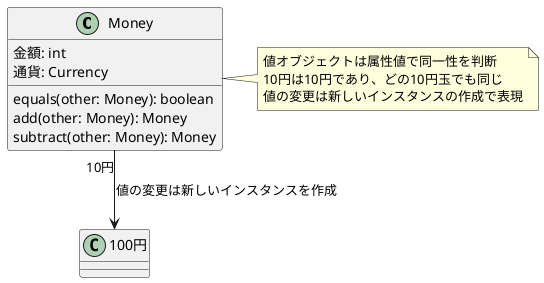

値オブジェクトは必ず不変なものとしてモデリングしますが、エンティティは可変になり得ます。しかし、モデリング結果として可変にする必要がなければ、不変なものとしてモデリングしても構いません。

一方、同一性の判断は必ず「識別子か、属性値か」というルールに則ります。

## 6.3 ドメインサービス

ドメインサービスは、「モデルをオブジェクトとして表現すると無理があるもの」の表現に使います。例えば、集合に対する操作などです。

よく使われるのはユーザーのメールアドレスを更新する際の重複チェックです。「指定されたメールアドレスはすでに使われているか？」と尋ねたいとき、その知識を1つのユーザーオブジェクト自身が答えられる、とするのは無理があります。自分自身のメールアドレスを知っていても、他のオブジェクトの状況については情報を持っていないからです。こういう場合に、ドメインサービスを使用します。

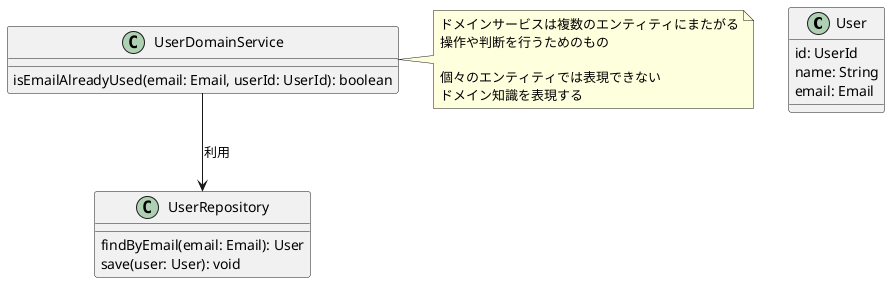

ただし、極力エンティティと値オブジェクトで実装するようにして、どうしても避けられない時にのみドメインサービスを使うようにしてください。ドメインサービスは手続き的になるので、従来の「ビジネスロジック層」の感覚で書いてしまいがちです。そうすると、結局従来のようなファットなクラスが異なるレイヤーに現れただけ、という結果になってしまいます。

人は意識しないとつい慣れ親しんだやり方に戻ってしまうので、始めたばかりの頃は特に意識的にエンティティ、値オブジェクトを使用するようにすることが必要です。

## 6.4 リポジトリ

リポジトリは「集約単位で永続化層へのアクセスを提供するもの」です。集約単位で、という制約を付けている理由は、「第3章3.1
集約」で述べたとおり強い整合性が求められるオブジェクトについて、ひとまとまりで整合性を確実に保証するためです。

集約のオブジェクトの親となるオブジェクトを集約ごとに1つ決め、そのオブジェクトを「集約ルート」と呼びます。リポジトリは集約ごとに1つだけであり、リポジトリに渡すもの、リポジトリから返されるものは必ず集約ルートのエンティティになり、その他の子オブジェクトは集約ルートがインスタンス参照した状態で常に扱います。リポジトリから子オブジェクトを直接返したり、子オブジェクト用のリポジトリを別途定義したりはしてはいけません。

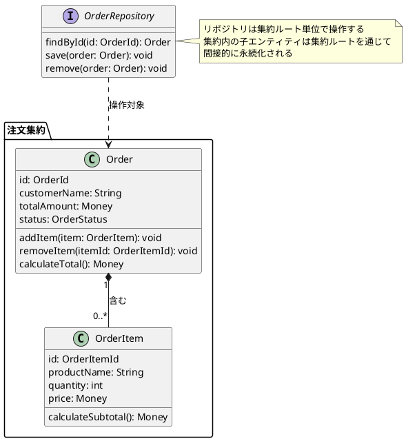

なお、「第5章アーキテクチャ」のオニオンアーキテクチャの節で説明した通り、リポジトリはインターフェイスがドメイン層、その実装クラスがインフラ層になります。これにより、ドメイン層は永続化手段（DBの種類やテーブル構造、ORマッパーなど）に関して一切知識を持たなくなり、純粋にドメイン知識だけに集中できるようになります。

設計上のポイントは「リポジトリはListのように扱う」ということです。ユーザークラスのListがあった時、そのListは「ユーザー登録する」「ユーザーを退会状態にする」というメソッドは持たないはずです。新規登録状態のユーザー、退会状態のユーザーをaddするという使い方をするでしょう。リポジトリも同じです。Listに持たせないようなメソッド、つまりドメイン知識(
ルール/制約)を持っていたとしたら、それは責務過剰なのでリポジトリから別のクラスに委譲しましょう。

この方針は、テスト時にも役立ちます。リポジトリが永続化層へのアクセスのみを提供していれば、テスト時にはリポジトリの実装クラスをオンメモリのモック実装に差し替えることが容易になります。この際、リポジトリがドメイン知識を実装していると、その部分のロジックをモック内で再度実装することになり、テスト内容が正しく保証されなくなるリスクが生まれます。

## 6.5 ファクトリー

オブジェクトの生成ロジックが複雑な場合や、他の集約を参照する必要がある場合、生成の責務を持ったオブジェクトを独立させます。これはドメインサービスの一種と捉えることができます。

ファクトリーはドメイン知識の表現のために、リポジトリを参照し、使用できます。

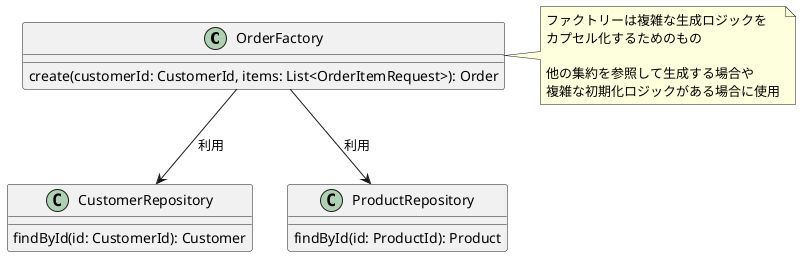

## 6.6 ドメイン層のそれ以外のオブジェクト

重要なことは、ドメイン層にはここで紹介されたパターン以外を使っても問題ないということです。

デザインパターンや、オブジェクト指向での手法を使うことにより「高凝集・低結合」にできるなら、積極的に使っていくべきです。実際によく使われるものとして、ファーストクラスコレクション、enumによるドメイン知識の表現といった実装があります。

ドメイン層は「ドメイン知識を表現する」「モデルを直接表現するオブジェクトを書く」ということが重要です。極論を言うと、それさえ実現できれば、どのような書き方をしても問題はありません。エンティティなどの戦術的設計パターンは、決まりではなく、あくまでもベストプラクティスなのです。

## 6.7 複数集約間の整合性確保

「第3章3.1.3 集約の境界の決め方」で、「複数集約間の整合性確保は、実装コストや難易度が上がる」と書きました。複数集約間の整合性を確保する方法は次の2つです。

1. アプリケーション層のメソッドで確保する
2. ドメインイベントを用いて結果整合性で確保する

1の方法は、ユースケースクラスの1メソッドの中で複数集約のオブジェクトをそれぞれのリポジトリを使って永続化する方法です。実装は簡単ですが、別のユースケースクラスのメソッドでは整合性を破る処理を書くことが可能になってしまいます。

2の方法は、ドメイン層のオブジェクトの操作に対してイベントを発火させ、別集約の操作を呼び出す方法です。確実に整合性確保ができますが、技術的に実装が複雑になってしまいます。本書では詳細は割愛します、実践DDDのドメインイベントの章に解説があるので、興味がある方は参照してください。

1の方法でも十分に実用可能です。最初はシンプルな1の方法を取り、慣れてきてから必要に応じて2の方法を検討してみるのが良いでしょう。

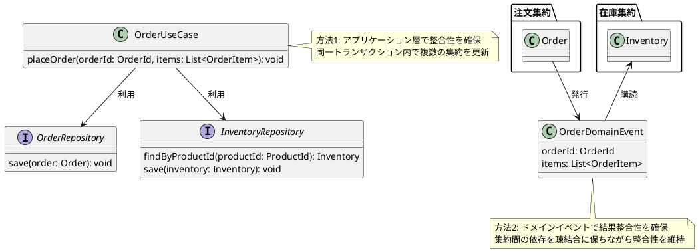

## 6.8 Q&A(ドメインオブジェクト)

### 6.8.1 ドメイン層にロジックを寄せる目的

**ドメイン層にロジックを寄せすぎると、修正時に影響範囲が大きくなり、逆に修正しにくくなるのではないでしょうか？
**

この質問は、安定依存の原則(SDP:Stable Dependencies Principle)
を意識したものだと思います。SDPは、「多数のコンポーネントから依存されたコンポーネントは修正しづらくなるので、モジュールはより安定した(
修正が少ない)モジュールに依存するべきだ」という原則です。

ドメイン層を独立させるという設計は、SDPに則ったものではありません。第1章で述べた通り、ドメインモデルは頻繁に更新し、実装にも反映していくものなので、ドメイン層に他の層が依存するのはむしろ逆を行っています。では、なぜそのような設計にするのでしょうか。

それは、「最も重要なドメイン層を、独立させて修正しやすくするため」です。

最も避けたいことは、DBやフレームワークの都合で「こんな実装にしたいけどこういう事情があるからしょうがないんだよね…」というように、理想的ではない実装で妥協するようなことです。そのような妥協を積み重ねると、モデルと実装が乖離し、目指したい問題解決ができなくなってしまいます。

そのため、特定のDBやフレームワークに依存せず、層自体を独立させることによって、修正しやすさを維持することを目指します。

なお、影響に関しては、テストで対応します。アプリケーション層でテストを書けば、ドメイン層の修正があっても影響範囲は確実に把握することが可能になり、内容に応じて修正判断できるようになります。

### 6.8.2 プリミティブ型の使用可否

**すべてを値オブジェクトにするのが好ましいのはわかっているのですが、時間や工数的な意味合いである程度端折ってプリミティブ型を使うことも多いです。実際はどこまで妥協しても良いでしょうか？
**

「すべてを値オブジェクトにするのが好ましい」とありますが、なぜでしょうか？

第1章の「課題ドリブン」の節で、解決したい課題を明確にして判断しよう、ということを書きました。値オブジェクトにする目的を明確にし、それに合うなら値オブジェクトに、合わないならプリミティブ型を使う、といった判断ができれば良いでしょう。

理由もなく、どのようなシチュエーションでもすべてを値オブジェクトにしなければいけない、ということはありません。

### 6.8.3 DBの値からインスタンスを再構成する方法

**コンストラクタ内に生成条件(初期状態)を実装した場合、DBから取ってきた値はどのように反映するのでしょうか？
**

専用のコンストラクタを設けます。このコンストラクタはすべての属性の値をそのまま受け取り、バリデーションをしません。

Javaのようにパッケージプライベートの可視性がある場合は、このコンストラクタの可視性をパッケージプライベートにし、同じパッケージのリポジトリからは呼べますが他のパッケージ(
特にアプリケーション層のクラス)
からは呼べないようにします。パッケージプライベートがない場合は、「fromRepository」や「reconstruct」といった命名規則で回避します。

```plantuml
@startuml
class User {
  -id: UserId
  -name: String
  -email: Email

  +User(name: String, email: Email)
  #User(id: UserId, name: String, email: Email)
  +{static} reconstruct(id: UserId, name: String, email: Email): User
}

note right of User::User(name: String, email: Email)
  通常のコンストラクタ
  バリデーションを実施
end note

note right of User::User(id: UserId, name: String, email: Email)
  再構成用のコンストラクタ
  パッケージプライベート
  バリデーションなし
end note

note right of User::reconstruct
  再構成用の静的ファクトリメソッド
  パッケージプライベートがない言語向け
end note
@enduml
```

### 6.8.4 再構成メソッドを書くべきレイヤー

**エンティティ・値オブジェクトの再構成用のコンストラクタは、ドメイン知識を表現しているわけではないのでインフラ層の責務ではないでしょうか？
**

たしかに、そのように捉えることは可能です。しかし、実際にドメイン層に再構成コンストラクタを持たせず、インフラ層のみで実現しようとすると、Javaの場合はリフレクションの利用が避けられなくなります。そして、その場合は型の恩恵が受けられなくなるという大きなデメリットが生じてしまいます。

ここは実際のメリット/デメリットを考慮して、ドメイン層のエンティティに再構成用のコンストラクタを持たせるのが現実解だと考えています。

この判断は言語にもよりますので、第1章でも述べた通り課題ドリブンで、解消したい課題とメリット/デメリットを考慮して判断してください。

## 6.9 Q&A(リポジトリ)

### 6.9.1 ドメインオブジェクトとDBの対応

**基本的に、ドメインオブジェクトのフィールドは、DBにおける該当テーブルのカラムと1対1で対応するという認識で合っていますか？
**

そうとは限りません。対応させることもできますし、させないこともできます。

一部のカラムはテーブルを分けたり、(適切と判断できればですが)
一部の複数の項目をjson型のカラムにまとめたり、といった選択も可能です。オブジェクトのデータ自体を1つの状態ではなく履歴型で保存するような選択肢もあります。また、テーブルにはupdateAtといったドメインオブジェクトには存在しないカラムを設けても良いのです。

リポジトリのインターフェイスがドメイン層、実装クラスがインフラ層で、依存の方向がインフラ層からドメイン層の向きであるのはそこにポイントがあります。ドメイン層ではインフラ層の影響を受けない抽象的なオブジェクトを定義し、インフラ層はインフラ層の事情(
パフォーマンスやトラッキング要件)などを考慮して最適な判断をすることができるのです。

この自由度が生まれることは、Active Record型ライブラリを使用してテーブルとオブジェクトが1対1に制限されるときには無い面白さです。

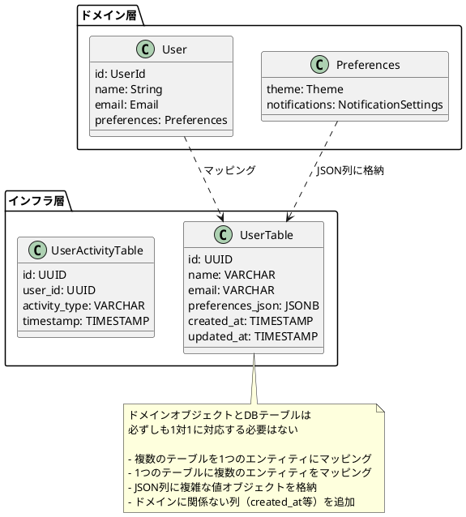

### 6.9.2 ソートの実装方法

**ソートはどこで行うのが良いのでしょうか？**

リポジトリのインターフェイスでは、永続化層に依存しない抽象的な実装(enumなど)
でソート順を引数で指定できるようにします。そして、実際のソート処理のためのクエリ組み立てなどはインフラ層のリポジトリ実装クラスで行います。永続化層がRDBの場合、引数で指定された内容を元にorder
by句を作成します。

このようにすると層の責務の矛盾なく、ソートキーを可変にできます。

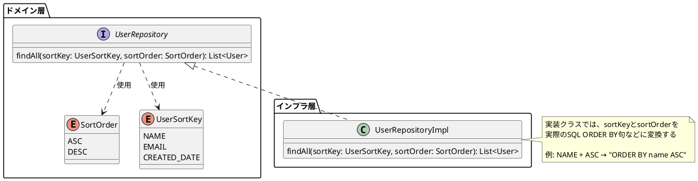

### 6.9.3 キャッシュの実装方法

**リポジトリのデータをパフォーマンス上の制約からキャッシュしたいとき、キャッシュはどこでどのように実装すればいいでしょうか？
**

リポジトリでキャッシュを考えるより、CQRSの使用を検討するのが良いでしょう。「第8章CQRS」で詳しく解説しますが、概要としてはドメイン層のモデルとは別に、参照に特化したクエリ用のモデルを定義するのです。クエリパフォーマンスをあげるのであれば、クエリモデルで情報取得するところでキャッシュ、という方が役割としては適切と考えられます。

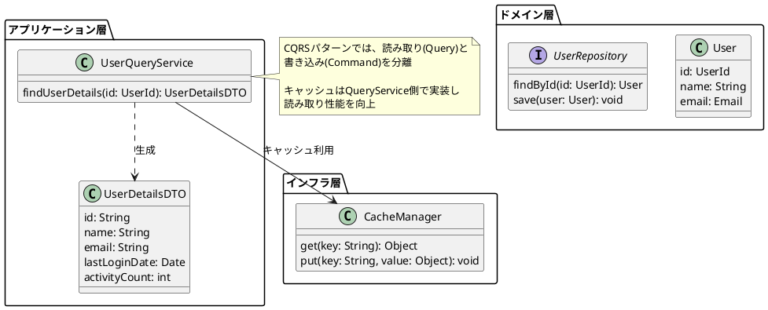

### 6.9.4 外部APIとリポジトリの関係

**Twitterのような外部APIを利用する時も、リポジトリパターンを使うのが良いでしょうか？**

外部APIに渡す値、外部APIから取得する値が、ドメインモデルとして意味を持つのであれば、ドメイン層のものとして定義してリポジトリで設計します。

そうではない例として、通知を扱う例を考えます。ユースケースとして通知を行いますが、ドメインモデルとしては定義しないと判断した場合は、アプリケーション層にNotificationAdapterといった名前のインターフェイスを定義し、実装クラスはインフラ層に配置します。Adapterという名前は、ポートアンドアダプターパターンから引用していますが、他にしっくりくる名前があればそちらを選択してください。

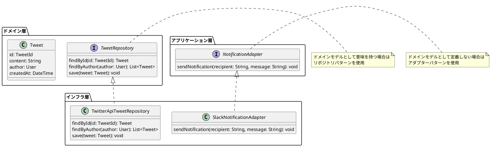

### 6.9.5 外部APIから取得した値の詰め替え方法

*

*

APIからデータを取ってきて、それをドメインオブジェクトに変換する際は「リポジトリの実装クラス内でAPIを呼び出し、取得したデータをドメインオブジェクトに変換する」という処理で良いでしょうか。それとも「ユースケースクラスでMapper的なクラスを呼び出す」のが良いのでしょうか？
**

前者の選択肢が良いです。リポジトリのインターフェイスはドメイン層であり、ドメインの知識としては「どういう条件を指定したらどういうオブジェクトが取得できるか」という定義(
What)
にだけ関心があり、そのHowは隠蔽したいのです。APIの呼び出し方や、取得結果を戻り値のオブジェクトに変換する方法はあくまでインフラ層の関心ごとになるので、インフラ層のクラスの中で完全に隠蔽するのが望ましいです。

### 6.9.6 エンティティ同士の紐付け

**User→Taskという1:Nのエンティティがあったとします。この関係を表すには、以下のどちらの実装が良いでしょうか？
**
**案1. TaskクラスにUserIdを持たせる**
**案2. UserクラスにTaskのListを持たせる**

これは集約の設計に依存します。「第2章2.1.2
ドメインモデル図」で解説した通り、オブジェクト間の参照関係は、集約内はインスタンス参照、集約外はID参照です。そのため、TaskとUserが異なる集約なら案1、同じ集約なら案2になります。

案1でTaskとUserの紐付けを変更する場合、TaskにassignUser(UserId userId)
といったメソッドを持たせます。また、「ステータスがアクティブなUserのみアサイン可能とする」というバリデーションを入れたい場合、引数にIDではなくUserオブジェクト自体を渡す事も可能です。

一方、案2の場合、変更前のUser内部のTaskのListから該当するTaskを除外し、新しいアサイン先のUser内部のListに追加します。この場合両方のUserをリポジトリに渡して保存する必要があります。これは若干違和感があるように思えますが、それはTaskとUserの集約が同じであることに無理があることが原因です。こういった気付きがあったら、その段階で集約範囲を変更し、案1の実装に切り替えます。

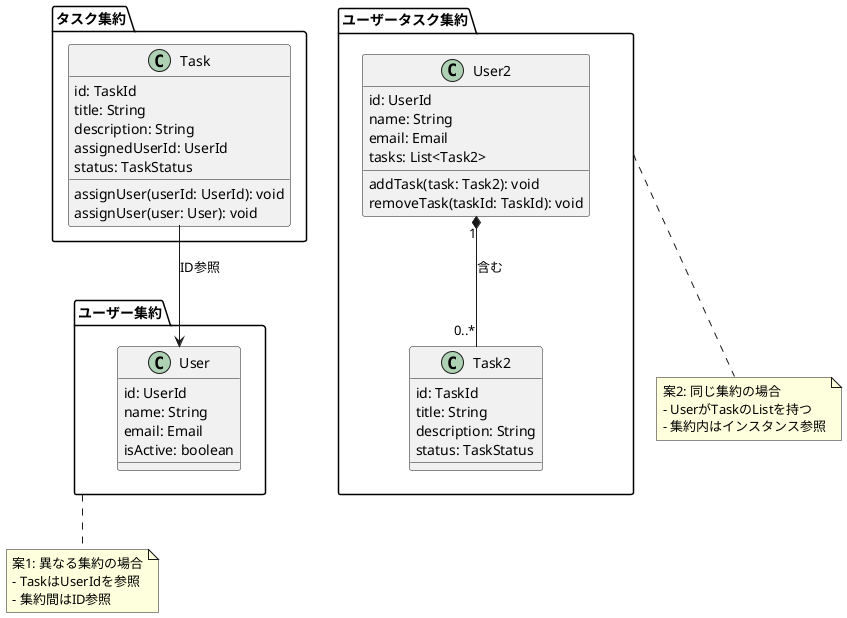

### 6.9.7 リポジトリのインターフェイスを定義するレイヤー

**リポジトリのインターフェイスを、アプリケーション層ではなくドメイン層に置く理由はありますか？**

ドメイン層のオブジェクトで、集約の範囲を明示するためです。リポジトリのメソッドはエンティティや値オブジェクトをどの単位で永続化するかを定義するので、この定義がアプリケーション層にある場合、ユースケースによって集約の境界が異なってしまう可能性があります。集約はドメインモデルの設計上非常に重要な意味を持つので、ドメイン層で確実に定義する必要があります。

実装上の都合でいうと、ドメイン層のドメインサービスからリポジトリを参照する必要性は時に発生しますが、アプリケーション層に定義すると参照できなくなってしまうのも困ります。

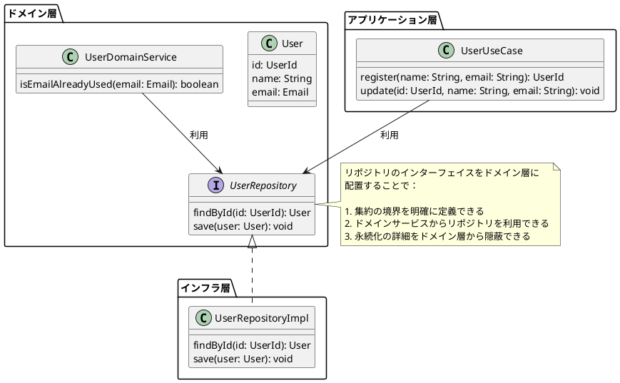

### 6.9.8 一部カラムを更新するときの扱い

**エンティティの一部分だけの更新をしたい場合、一部分だけリポジトリに渡すのでは無く、エンティティを丸ごと渡して丸ごと更新する必要がありますか？
**

その通りです。リポジトリは必ず集約単位で更新処理を行います。集約は「必ず守りたい強い整合性を持ったオブジェクトのまとまり」なので、整合性を集約ルートのオブジェクトに管理させます。一部のデータを直接永続化をしてしまうことは、整合性の管理ができなくなってしまうために避けます。

### 6.9.9 ドメインオブジェクトからリポジトリ操作の可否

**ユースケースからではなく、エンティティからリポジトリを利用して、DBからの取得や更新などの操作をしても良いものでしょうか？
**

エンティティが複数の責務を持つことになるので、非推奨です。第4章で解説した通り、一般的に責務が増えることは凝集度が下がり、可読性や保守性を下げます。

## 6.10 Q&A(その他)

### 6.10.1 ドメインサービスの命名

*

*

ドメインサービスも責務に応じた名前が付けられると思います。何からの距離計算をするサービスに対して、「DistanceCalculationDomainService」ではなく「DistanceCalculator」といった「Service」がつかない名前でも問題ないでしょうか？
**

特に問題ありません、名前が適切になるのは良いことです。その場合は命名規約を作り、「Service」をつける、つけないは統一しましょう。

### 6.10.2 リポジトリを通じた削除方法

**リポジトリでエンティティを削除する場合、削除対象のエンティティを渡すのか、IDだけ渡すのか、どちらが良いでしょうか？
**

IDだけで良いでしょう。集合に対する操作として、削除したいオブジェクトを識別子で指定して削除する、ということは概念としても矛盾がありません。

実装面でも、取得結果を別の用途で使う場合を除いて、削除対象のエンティティを一度取得するコストは無駄になるので不要です。

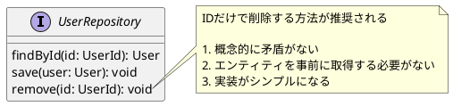

---

## まとめ

本章では、ドメイン層に実装するクラスの詳細を解説しました。エンティティ、値オブジェクト、ドメインサービス、リポジトリ、ファクトリーなどの戦術的設計パターンは、ドメインモデルを効果的に表現し、変更に強い実装を実現するためのベストプラクティスです。

これらのパターンを適切に使い分けることで、ドメイン知識を明確に表現し、ビジネスルールの変更に柔軟に対応できるコードを書くことができます。また、Q&Aセクションで取り上げた実装上の疑問点は、実際の開発で直面する可能性の高い課題への対応方法を示しています。

次章では、これらのドメイン層のクラスを活用するアプリケーション層の実装について解説します。
