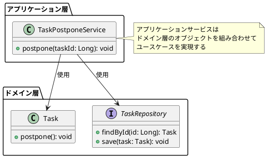
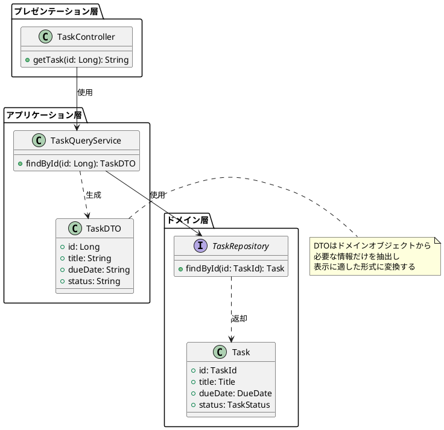
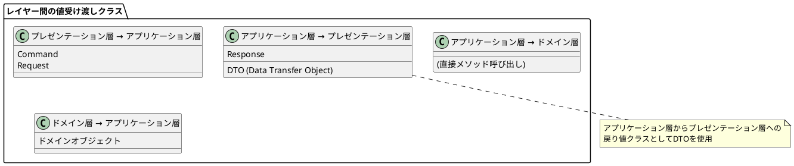
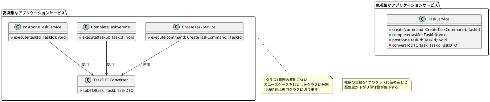
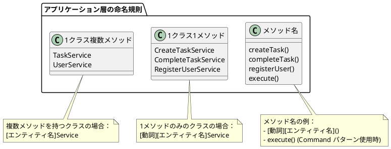

# 第7章 アプリケーション層の実装

本章では、アプリケーション層に実装するクラスの詳細を解説します。

エヴァンス本のレイヤードアーキテクチャや、オニオンアーキテクチャの原本では「アプリケーション層」という名前で、本書でもこの名称を使用します。

同様に、クラスもアプリケーションサービスクラスと呼びます。

## 7.1 アプリケーションサービス

アプリケーションサービスクラスは、ドメイン層のクラスが公開しているメソッドを組み合わせて、ユースケースを実現します。具体的には、ドメインオブジェクトの生成や状態の変更、リポジトリを使用した永続化などを行います。

第2章のタスク延期のアプリケーションサービスクラスを見直しましょう。

```java
// リスト7.1 TaskPostponeService.java
public class TaskPostponeService {

  @Autowired
  private TaskRepository taskRepository;

  @Transactional
  public void postpone(Long taskId) {
    Task task = taskRepository.findById(taskId);
    task.postpone();
    taskRepository.save(task);
  }
}
```



ドメイン知識(ルール/制約)をドメイン層のクラスに実装できると、アプリケーションサービスクラスには抽象度の高い、ユースケース記述のような実装が残ります。

リスト7.1のpostponeメソッドでは、「更新対象のタスクを取得し、延期を指示し、保存する」ということ(What)
を行なっていますが、延期をどのように処理するか(How)はドメイン層のクラスに隠蔽されています。

ドメイン層が整合性を保証できるメソッドのみを公開していれば、アプリケーション層はそれを組み合わせることで安心してユースケースを実現できます。この組み合わせを行うことが、アプリケーションサービスクラスの責務ということになります。

## 7.2 アプリケーションサービスからの戻り値クラス

アプリケーション層からプレゼンテーション層に返す値の型については、以下の2つの方針が考えられます。

1. 専用の戻り値クラスに詰め替えて返す
2. ドメイン層のクラス(ドメインオブジェクト)をそのまま返す

長期的に保守性を高めるには、1の方が有利です。1のメリットデメリットを比較すると、以下の通りです。

* メリット
    - ドメインオブジェクトに、プレゼンテーションに関連する処理が混入するのを防げる
    - ドメイン層の修正の影響を、プレゼンテーション層が直接受けなくなる
* デメリット
    - ドメインオブジェクトからの詰め替えコストが発生する

2の選択肢は、1のメリットデメリットの裏返しとなります。

ドメインオブジェクトをプレゼンテーション層に渡してしまうと、表示に関わるメソッド(
数値の書式を変換するなど)
をついドメインオブジェクトに生やしてしまいがちです。ドメインオブジェクトの責務はドメイン知識(
ルール/制約)を表現することなので、表示に関する処理は責務外の処理になります。このような事態を最初から防ぐために、ドメインオブジェクトを返さない、というのは有効な方針です。

最初は、詰め替えコストを嫌がって2の選択肢を取りがちですが、気がついたらドメインオブジェクトが責務外のメソッドで膨れ上がっている(
低凝集になっている)、という事態を誘発します。それを回避するには、1の選択肢を取るのが良いでしょう。



### 戻り値クラスの名称

アプリケーション層の戻り値専用クラスの名称はDDDで特に定義はされていないので、プロジェクトごとに決める必要があります。

本書では、このクラスをDTO(Data Transfer Object)
と定義しています。DTOというのはレイヤ間の受け渡しに広く使われがちですが、アプリケーションサービスからの戻り値のみに使用し、他のクラスは別の名称を使用します。



## 7.3 Q&A

### 7.3.1 クラスの分割単位

**アプリケーションサービスクラスは、どのような粒度で分割するのが良いでしょうか？**

「1クラスに1パブリックメソッド」とするのが良いでしょう。1クラスに複数のパブリックメソッドを書くと、凝集度が下がり、保守性が下がります。具体的なデメリットとして、次のようなものがあります。

* 複数メソッド分の依存クラス(リポジトリなど)やプライベートメソッドを持つことになり、参照関係が追いにくくなる
* テストクラス側のメソッド数がその数倍に増えて対応がわかりにくくなる

この対応として、パブリックメソッド単位でクラスを分割すると、アプリケーションサービスの凝集度が高まり、保守性が高まります。共通の処理が欲しくなった場合は、プライベートメソッドではなく、その責務を負ったクラスとして切り出すのが良いでしょう。例えば、共通の変換処理があればコンバーターと名のつくクラスとして切り出し、複数アプリケーションサービスクラスで共有する、といったものです。



この方針はYAGNI(必要になったら)でも構いません。最初は1つのクラスにまとめて、明らかに分割が必要になってから分割するのも選択肢の一つです。

ただし、1クラスに複数メソッドを詰め込む理由が、「慣習」「面倒くさい」といった理由ではないか、考えてみましょう。高凝集・低結合の原則を思い出してください。アプリケーションサービスクラスの責務は明確で、保持するデータと、メソッドは関連があるでしょうか。関連が薄い場合、それは低凝集となり、可読性や保守性が下がるのです。

### 7.3.2 命名規則

**アプリケーション層のクラスの命名規則や、ユースケースを実行するメソッドの命名規則はどのようにすれば良いでしょうか？
**

これはプロジェクトごとに決めて良いものですが、一例として紹介します。

メソッド名は、ユースケース図の吹き出し一つに該当するような名前にすることが多いです。吹き出しで「タスクを作成する」だったらcreateTaskといった形です。

クラス名は、1クラスに複数メソッドある場合は動詞を抜いたような名前(TaskService)
、1クラスに1メソッドの場合はメソッド名にServiceをつけた名前(CreateTaskService)にすることが多いです。


