# 第8章 CQRS

CQRS(Command Query Responsibility Segregation: コマンドクエリ責務分離)
は、DDDを実装する上で避けられない課題を解決する方法です。レイヤーとしてはアプリケーション層に定義する内容になりますが、ボリュームが大きいためアプリケーション層に続いて独立した章として解説します。

## 8.1 DDDの参照系処理で発生する問題

DDDの戦術的設計パターンを使っていると、永続化層との入出力はリポジトリを使うことになります。更新系の処理では、エンティティや値オブジェクトでドメイン知識を表現し、リポジトリを使って集約単位で永続化するという構成をとると、非常に保守性の良いものになります。

しかし、参照系の処理、特に一覧画面で複数の集約の情報を表示したいような場面で、リポジトリを使用するだけだと問題が発生することがあります。

例として、次のようなケースを考えます。タスク、ユーザー、ラベルという3つの集約があり、それぞれにリポジトリがあるとします。

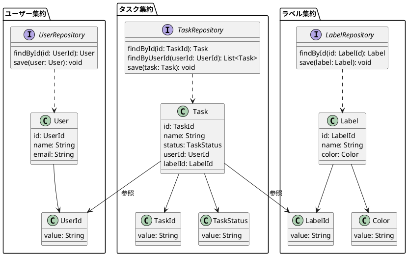

そのような場合に、以下のようなタスク一覧画面を作成することになりました。

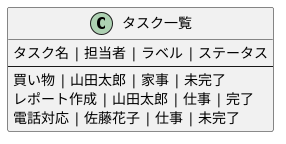

これを1つのアプリケーションサービスクラスで実現しようとすると、3つのリポジトリからそれぞれ値を取得し、戻り値のクラスに詰め替えるような実装にせざるを得ません。すると、以下のような問題が発生します。

* 複数の集約から値を取得して戻り値の型に詰め替える処理が、ループが増えて読みにくいコードになる
* 画面に返す必要のない値を取得するのでパフォーマンスが悪化する
* 複数集約の条件で絞り込んでのページングができない

上記のような一覧画面が必要になることは多いので、ほとんどのプロジェクトで突き当たる問題です。

## 8.2 解決策

CQRSを導入します。CQRSとは、「参照に使用するモデルと更新に使用するモデルを分離する」というアーキテクチャです。モデルという言葉は多義語ですが、この文脈ではアプリケーションコード上のモデル、つまり更新系のクラスと参照系のクラスを分けるということになります。

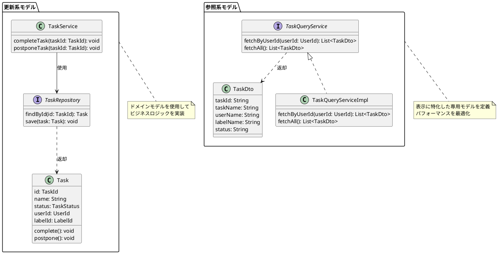

更新系モデルは、ドメインオブジェクト(エンティティ、値オブジェクトなど)をそのまま使用します。

参照系モデルは、特定のユースケースに特化した値の型を定義します。また、その値を取得するためのサービスも独自に定義します。例として、以下のようなクラスになります。

```java
// リスト8.1 TaskDto
public class TaskDto {
    private String taskId;
    private String taskName;
    private String userName;
    private String labelName;
}

// リスト8.2 TaskQueryService
public interface TaskQueryService {
    public List<TaskDto> fetchByUserId(UserId userId);
}
```

本書では参照用モデルの型をDTO、それを取得するためのサービスをクエリサービスという命名にしています。これは公式な定義は特にないので、各プロジェクトで決めてください。

### 8.2.1 参照用モデルの型を定義するレイヤー

参照用モデルの型を定義するクラスは、アーキテクチャ上どのように位置付けられるのでしょうか。

クエリサービスのインターフェイスと戻りの型をアプリケーション層に、クエリサービスの実装クラスはインフラ層に配置します。アプリケーション層は「引数でこのような条件を指定すると、このような型で返ってくる」という抽象的な知識(
What)だけ持ち、値の取得に関する具体的な知識(How)はインフラ層に隠蔽します。(
クエリサービスのインターフェイスがドメイン層ではなくアプリケーション層である理由は後述します)

```plantuml
@startuml
!include <C4/C4_Container>

LAYOUT_WITH_LEGEND()

Person(user, "ユーザー")

Container_Boundary(application, "アプリケーション") {
  Container(presentation, "プレゼンテーション層", "Controller, View", "ユーザーインターフェース")

  Container_Boundary(application_layer, "アプリケーション層") {
    Component(application_service, "アプリケーションサービス", "TaskService", "ユースケースを実現")
    Component(query_interface, "クエリサービスインターフェース", "TaskQueryService", "参照系の抽象")
    Component(dto, "DTO", "TaskDTO", "参照系の戻り値型")
  }

  Container_Boundary(domain_layer, "ドメイン層") {
    Component(domain_model, "ドメインモデル", "Task, User, Label", "ドメイン知識を表現")
    Component(repository_interface, "リポジトリインターフェース", "TaskRepository", "永続化の抽象")
  }

  Container_Boundary(infrastructure_layer, "インフラ層") {
    Component(repository_impl, "リポジトリ実装", "TaskRepositoryImpl", "更新系の永続化")
    Component(query_impl, "クエリサービス実装", "TaskQueryServiceImpl", "参照系の永続化")
  }
}

Container(database, "データベース", "PostgreSQL", "データの永続化")

Rel(user, presentation, "利用")
Rel(presentation, application_service, "利用")
Rel(presentation, query_interface, "利用")
Rel(application_service, domain_model, "操作")
Rel(application_service, repository_interface, "利用")
Rel(query_interface, dto, "返却")
Rel(repository_interface, domain_model, "返却")
Rel(repository_impl, repository_interface, "実装")
Rel(query_impl, query_interface, "実装")
Rel(repository_impl, database, "更新系クエリ")
Rel(query_impl, database, "参照系クエリ")

note right of query_interface
  アプリケーション層に配置
  Whatのみを定義
end note

note right of query_impl
  インフラ層に配置
  Howを実装
end note
@enduml
```

永続化層がRDBの場合、クエリサービスの実装クラスではDTOに詰め替えるのに必要な値を取得するクエリを書きます。この際のクエリは、複数テーブルをJOINして1リクエストで取得する、必要なカラムのみSELECTする、というようにパフォーマンスを最適化させるために自由に記述することができます。このチューニングが自由になることがリポジトリを使用する場合との大きな違いです。

また、クエリを実装する方法も、保守性を考慮して最適な方法を選ぶことができます。直接StringでSQLを書いても、クエリビルダのようなライブラリを使用しても良く、更新系で使用しているものとは異なるライブラリを使用しても構いません。

なお、筆者がJavaのプロジェクトで実装するときは、リポジトリもクエリサービスもjOOQ[^1]
というタイプセーフにクエリを実行できるライブラリを使用しています。

[^1]: https://www.jooq.org/

## 8.3 メリット、デメリット

前述の問題の裏返しになりますが、以下のようなメリットがあります。

* 複数集約にまたがるデータを取得する際のコードがシンプルになり、保守性が高まる
* クエリパフォーマンスが上がる、チューニングしやすくなる
* 複数集約の条件で絞り込んでのページングができるようになる

一方、デメリットは以下のようなものがあります。

* ドメインオブジェクトのデータが参照されている場所が追いにくくなる
* アーキテクチャ自体が複雑になり、理解にコストがかかる

デメリットの1つ目について補足します。CQRSを使用しない場合、ドメインオブジェクトのデータがどこで使用されるかを調べるためには、ドメインオブジェクトのゲッターから参照元を追えばすべて把握できます。しかし、CQRSを使用すると、参照系のオブジェクトが別途作られることにより、その方法ではすべての参照が追えなくなってしまいます。

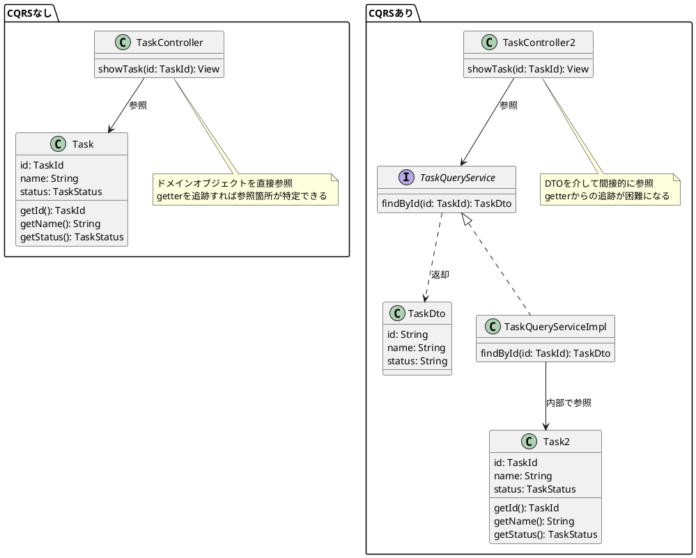

このように、メリットは非常に大きいですが、デメリットも確実にあるため、常に使用すれば良いというものではありません。しかし、「問題」の最後に述べた通り、DDDを用いている限りは避けられない重要な問題を解決する手法です。問題の大きさ、メリットデメリットを考慮して導入判断できることが重要です。

## 8.4 実装時の注意事項

### 8.4.1 部分的導入の可否

誤解されることがありますが、CQRSは部分的な導入が可能です。

つまり、「参照用モデルと更新用モデルを完全に分ける必要はない」ということです。必要なところだけ参照に特化したモデルを導入するのが適切です。

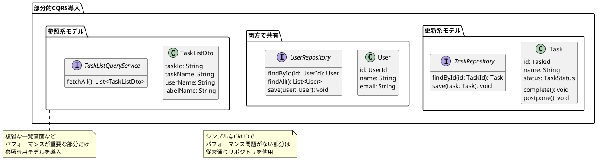

### 8.4.2 型を定義するレイヤーがアプリケーション層である理由

なぜ参照用モデルの型をアプリケーション層に定義するのでしょうか。それは、最適な参照用モデルは個別のユースケースに依存したものだからです。

例えば、タスク一覧画面とは別に、自分のタスクだけを表示する画面があったとします。

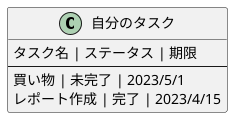

その他に、ユーザーごとに最後に完了したタスクを表示する画面もあったとします。

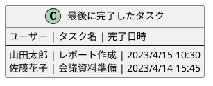

表示時に取得する内容は画面、ユースケースによって異なっています。そのため、取得内容を定義する型は個別に定義するべきものです。そして、ドメイン知識(
ルール・制約)は一切表現していないので、ドメイン層の責務には含めるべきではないでしょう。以上のことから、アプリケーション層に定義します。

また、これらの戻り値の型は完全に一致しない限り使い回すべきではありません。あるDTOには10個の項目があり、ユースケースAでは1～5個目を、ユースケースBでは3,
4, 7～10個目を使用する、ユースケースCでは・・・という風に最大公約数な項目を持つDTOを定義してしまうと、どこで何を使っているのかがわからなくなり、肥大化して保守性がどんどん落ちていきます。

ここでも責務を意識することが重要です。ユースケースA、B、Cで使い回すクラスは、「このクラスは何をするクラスか？」という問いに端的に答えられるでしょうか？ユースケースごとに型を分ければ、「このクラスは×××ユースケースで取得する値を表現するクラス」というように責務が明確に定義できます。

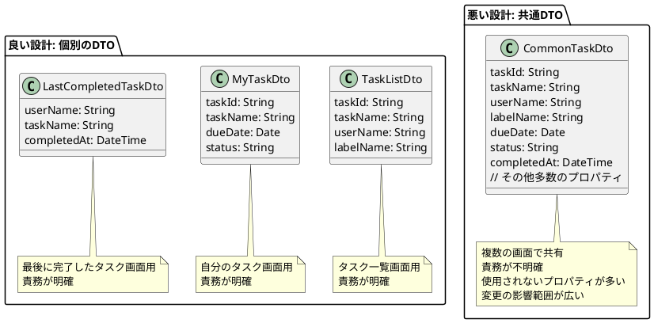

### 8.4.3 更新系との整合性を確保する方法

アプリケーション層でテストを書きましょう。参照処理だけのテストだけでも書くのが最低限ですが、業務上重要な部分に関しては、更新処理との結合テストを書くと良いでしょう。

例えば、承認処理をした結果を一覧画面に反映する、といったケースでは、承認処理のアプリケーションサービスと、参照処理のクエリサービスを続けて呼び出すテストを書きましょう。

モデルを分けても、テストさえあればバグの混入を防ぐことは可能です。

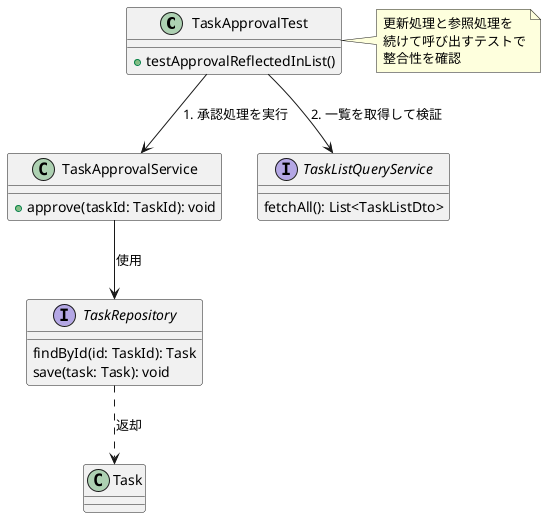

## 8.5 よくある誤解

### 8.5.1 データソース分離の必要性

データソースを分離するアーキテクチャは、以下のようなものです。

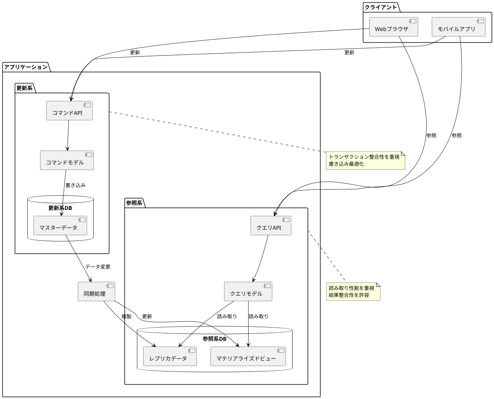

「CQRS = データソース分離」と思われることがありますが、これは誤解です。

データソース分離は、別の問題の解決のために行う、モデル分離の次のステップと考えることができます。解決する問題は、パフォーマンス問題です。

参照系処理のパフォーマンスを上げたい場合、参照用インスタンスを更新系のレプリカにすれば、参照系のインスタンスだけスケールアウトするなどのパフォーマンスチューニングが可能になります。インスタンス単位で分けなくても、参照系処理向けにマテリアルビューを作成する、というものデータソース分離の一環として考えることができます。

また、更新系処理のパフォーマンスを上げたい場合は、更新時にはNoSQLに高速に書き込んでおき、参照時には集計結果を表示するといった手段などが選択可能です。

データソース分離が解決する問題はモデル分離とは別のものなので、きちんと問題と解決策が対応しているかを判断して、導入を判断する必要があります。

### 8.5.2 イベントソーシングとの関係

「CQRS = イベントソーシング」も誤解です。

こちらもCQRSの文脈でよく一緒に出てくるので混乱しやすいですが、「CQRSとイベントソーシングは相性が良い」というだけであり、その二つは別で考えることができます。

イベントソーシングとは、データ永続化時にドメインオブジェクトの状態をそのまま保存するのではなく、「ユーザーが登録された」「タスクが完了された」といったイベントそのものを永続化するというアーキテクチャです。

```plantuml
@startuml
package "従来の永続化" {
  class Task {
    id: TaskId
    name: String
    status: TaskStatus
  }

  database "データベース" {
    [タスクテーブル]
  }

  Task --> [タスクテーブル]: 状態を直接保存

  note bottom of [タスクテーブル]
    id | name | status
    --+------+-------
    1 | 買い物 | 未完了
    2 | レポート | 完了
  end note
}

package "イベントソーシング" {
  class TaskEvent {
    eventId: EventId
    taskId: TaskId
    type: EventType
    data: EventData
    timestamp: DateTime
  }

  database "イベントストア" {
    [イベントテーブル]
  }

  TaskEvent --> [イベントテーブル]: イベントを保存

  note bottom of [イベントテーブル]
    eventId | taskId | type | data | timestamp
    --------+--------+------+------+----------
    1 | 1 | 作成 | {name: "買い物"} | 2023-01-01 10:00
    2 | 2 | 作成 | {name: "レポート"} | 2023-01-02 11:00
    3 | 2 | 完了 | {} | 2023-01-03 15:30
  end note
}
@enduml
```

参照時にすぐクエリできるように、参照用データを別途集計する処理を挟むと、必然的に参照/更新のモデルの分離や、データソースの分離が行われます。

つまりイベントソーシングはCQRS、データソース分離と併せて導入されますが、CQRS=イベントソーシングではないのです。

なお、イベントソーシングの導入目的はパフォーマンス最適化以外に、データを積み上げ型で永続化して証跡を残せることや、データ更新によるバグ発生を防ぐことなどが挙げられます。

## 8.6 Q&A

### 8.6.1 クエリサービスの分割判断

*

*

1回DBから取得した結果を用いて再度検索をしたい場合、アプリケーションサービスクラスで複数のクエリサービスを使っても良いでしょうか？それとも、1つのクエリサービスでアプリケーションサービスを通さず、全処理を行ってDTOを作るほうが良いのでしょうか？
**

2つの検索の関係がシンプルであれば、1つのクエリサービスでも良いと思います。1つ目の検索結果に応じて2つ目の検索条件を変えるなど、クエリサービス内の処理が複雑になる場合は、分離した方がテストが書きやすくなるので良いでしょう。

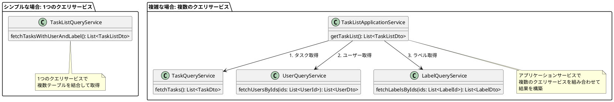

### 8.6.2 DTOとして返した値の扱い

**クエリサービスが返すDTOは、コントローラー側でテンプレートエンジン用のViewModelや、APIが返すjson用クラスなどに変換するイメージでしょうか。
**

まさしくその通りです。クエリサービスの戻り値はクライアントに依存しない抽象的な型で、コントローラーがそこからクライアントに応じたクラスに詰め替えるのです。

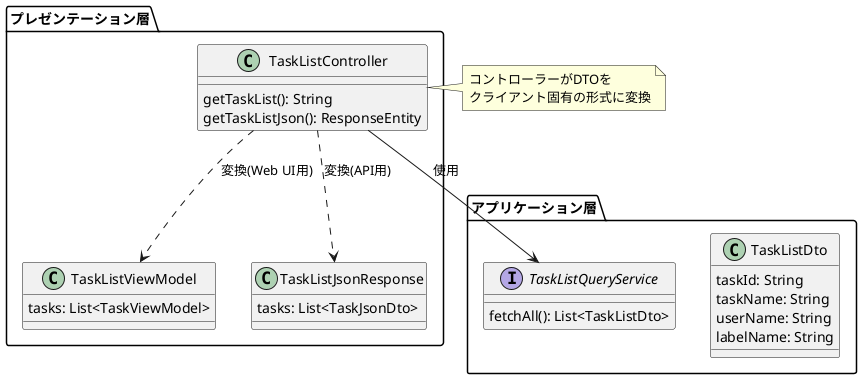

### 8.6.3 参照用モデルの使い所

**何らかのマスタデータを使用する際、そのマスターのメンテナンス画面では更新用モデルを使うと思いますが、セレクトボックスなどで表示用にデータを取得するのはクエリサービスでよいのでしょうか？
**

「8.4.1
部分的導入の可否」の節で、「必要なところだけ参照に特化したモデルを導入する」のが良いと書きました。どのような画面でも、参照用モデルを定義する必要性がなければ、更新用モデルであるドメインオブジェクトを使用します。

そのため、セレクトボックスのデータを取得するのに、何らかの必要性がなければクエリサービスを定義せず、リポジトリを利用する方法で構いません。

### 8.6.4 実装の都合にドメイン層が影響を受ける場合

**N+1クエリやトランザクションの都合に合わせて、泣く泣くドメインモデルを変更することがあるのですが、そのようにアプリケーション全体の観点から仕方なくドメインモデルを曲げられることはありますか？
**

トランザクション範囲を考慮して集約の範囲を検討することは必要なことなので、よくあります。

しかし、N+1問題という参照時の(しかも、使用するライブラリにも依存する)
問題に起因してドメインモデルが歪められるのは望ましくありません。そのような事情はインフラ層に隠蔽できないか検討し、必要であればCQRSの導入も選択肢に入れます。

### 8.6.5 集約内の一部の値だけ取得したい場合の対応方法

**集約内の要素である大きめの値オブジェクトだけデータを取得したい場合はどのようにすれば良いでしょうか？
**

基本的にはリポジトリでドメインオブジェクトを取得し、アプリケーションサービスの処理で必要な項目だけ詰め替えれば良いですが、パフォーマンスが問題になる場合はCQRSの導入を検討します。

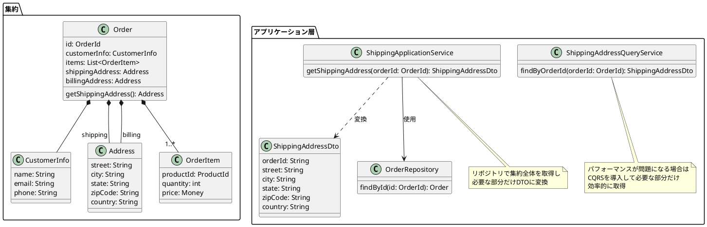
