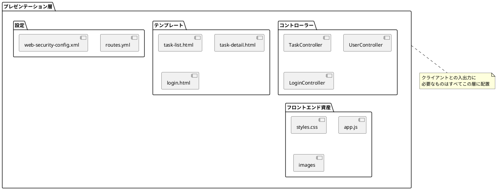
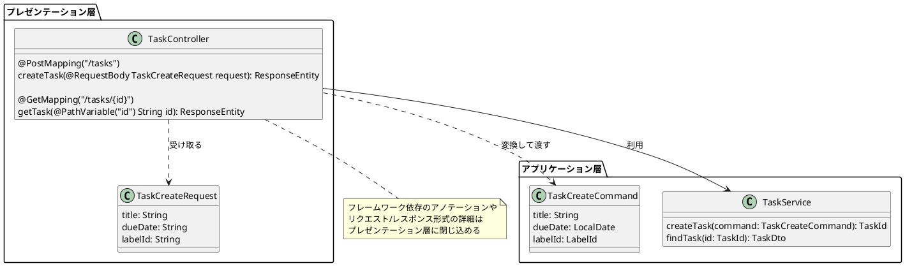
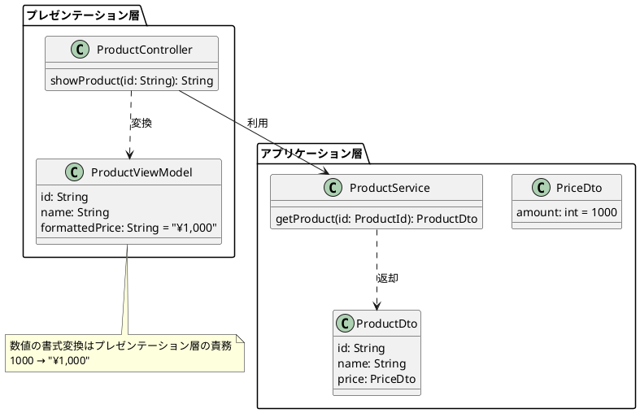
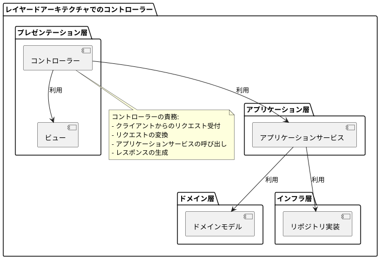

# 第9章 プレゼンテーション層の実装

本章では、プレゼンテーション層の実装に関する詳細を解説します。

## 9.1 プレゼンテーション層の処理概要

プレゼンテーション層は、クライアントとアプリケーションの入出力を実現します。そのために、クライアントとアプリケーション層の間に位置し、リクエスト/レスポンスの変換を行います。

```plantuml
@startuml
!include <C4/C4_Container>

LAYOUT_WITH_LEGEND()

Person(user, "ユーザー")

Container_Boundary(clients, "クライアント") {
  Container(web_browser, "Webブラウザ", "HTML/CSS/JS", "ユーザーインターフェース")
  Container(mobile_app, "モバイルアプリ", "iOS/Android", "ユーザーインターフェース")
  Container(external_system, "外部システム", "API Client", "他システムとの連携")
}

Container_Boundary(application, "アプリケーション") {
  Container_Boundary(presentation, "プレゼンテーション層") {
    Component(web_controller, "Webコントローラー", "Spring MVC", "HTML生成")
    Component(api_controller, "APIコントローラー", "REST API", "JSON応答")
  }

  Container_Boundary(application_layer, "アプリケーション層") {
    Component(application_service, "アプリケーションサービス", "", "ユースケースを実現")
  }

  Container_Boundary(domain_layer, "ドメイン層") {
    Component(domain_model, "ドメインモデル", "", "ドメイン知識を表現")
  }
}

Rel(user, web_browser, "利用")
Rel(user, mobile_app, "利用")
Rel(external_system, api_controller, "API呼び出し")

Rel(web_browser, web_controller, "HTML/Form", "HTTP")
Rel(mobile_app, api_controller, "JSON", "HTTP")

Rel(web_controller, application_service, "呼び出し")
Rel(api_controller, application_service, "呼び出し")
Rel(application_service, domain_model, "操作")

note right of web_controller
  HTML形式のレスポンス
  Form形式のリクエスト
end note

note right of api_controller
  JSON形式のレスポンス
  JSON形式のリクエスト
end note

note right of application_service
  クライアント非依存の
  ピュアなオブジェクト
end note
@enduml
```

あるコントローラーではJSON形式のリクエストを受け、JSON形式のレスポンスを返しますが、別のコントローラーではHTMLのフォームからapplication/x-www-form-urlencoded形式のリクエストを受け、HTMLをレンダリングして返すかもしれません。その時、アプリケーションサービスクラスのリクエストとレスポンスは、特定のクライアントに依存しない、ピュアなオブジェクト(
Javaではいわゆるポジョ(POJO)と呼ばれるもの)にします。

これは、1つのアプリケーションの中で複数のプロトコルのコントローラーが存在しなくても必要です。「クライアントとアプリケーションの入出力の実現」という責務をプレゼンテーション層で完結させることにより、プレゼンテーション層、アプリケーション層以下の凝集度を高め、可読性や保守性を高めることができます。

## 9.2 プレゼンテーション層のクラス、ファイル

この層には一般にコントローラーと呼ばれるクラスが定義されます。それ以外に、HTMLテンプレートや、使用するWebアプリケーションフレームワークに応じたルーティング設定ファイルもこのレイヤーのものだと考えられるでしょう。

クライアントとの入出力に必要なものは、すべてこのレイヤーのものになります。



## 9.3 リクエスト仕様の定義

リクエスト仕様の定義として、通信プロトコル、エンドポイント、パラメーターといったことを決定します。

例として、プレゼンテーション層がJSONリクエストを受けるAPIの場合、APIドキュメントとしてその仕様を公開します。HTMLレンダリングするプレゼンテーション層の場合はそのように仕様が明示されませんが、何らかの実装で暗黙的に意思決定をしていることは同じです。

コントローラーの実装は多くの場合Webアプリケーションフレームワークに強く依存しますが、その依存をプレゼンテーション層のみに限定できれば、アプリケーション層以下は特定のフレームワークに依存しない実装にすることが可能です。



## 9.4 レスポンス仕様の定義

レスポンスの仕様を定義します。HTMLレンダリングを行うコントローラーの場合、UIにまつわるもの(
色、文字の書式など)を決めるのもプレゼンテーション層の責務です。

特に書式に関するものがこの層の責務であるということは重要です。例えば、アプリケーションサービスが数値を表す型で「1000」という数値を返したものを、画面ではカンマ区切りで単位をつけて表示するとします。



この変換に関する責務を持つのは、プレゼンテーション層です。アプリケーション層やドメイン層のオブジェクトが、保持する値を表示用にフォーマットするメソッドを持っていたら、それは責務違反となります。凝集度が下がり、結果として可読性、保守性を下げることになります。これは避けるべきです。

```plantuml
@startuml
package "ドメイン層" {
  class Price {
    amount: int = 1000

    getFormattedAmount(): String {
      return "¥" + formatWithCommas(amount);
    }
  }

  note right of Price::getFormattedAmount
    責務違反！
    表示用フォーマットはドメイン層の
    責務ではない
  end note
}

package "アプリケーション層" {
  class PriceDto {
    amount: int = 1000

    getFormattedAmount(): String {
      return "¥" + formatWithCommas(amount);
    }
  }

  note right of PriceDto::getFormattedAmount
    責務違反！
    表示用フォーマットはアプリケーション層の
    責務ではない
  end note
}
@enduml
```

そのような処理は、プレゼンテーション層の責務として行うべきです。方法としてはコントローラーごとにメソッドを追加する、型に対応したコンバーターを作成するなどが考えられます。この最適解は内容によって異なるので一意に示せませんが、まずはレイヤーの責務を守ることが重要です。

```plantuml
@startuml
package "ドメイン層" {
  class Price {
    amount: int = 1000
  }
}

package "アプリケーション層" {
  class PriceDto {
    amount: int = 1000
  }

  class ProductService {
    getProduct(id: ProductId): ProductDto
  }

  class ProductDto {
    id: String
    name: String
    price: PriceDto
  }
}

package "プレゼンテーション層" {
  class PriceFormatter {
    format(price: PriceDto): String {
      return "¥" + formatWithCommas(price.amount);
    }
  }

  class ProductController {
    priceFormatter: PriceFormatter

    showProduct(id: String): String
  }

  ProductController --> PriceFormatter: 利用
}

ProductService ..> ProductDto: 返却
ProductController --> ProductService: 利用

note right of PriceFormatter
  正しい責務の配置
  表示用フォーマットはプレゼンテーション層で行う
end note
@enduml
```

### Ruby on Railsのコントローラーとの違い

本章で解説しているコントローラーは、Ruby on Railsのコントローラーとは全く別の責務を持つものです。

Ruby on Railsでは、基本的にはModel、View、Controllerの3つでアプリケーションを構成します。この場合の各モジュールの責務を整理すると以下のようになります。

```plantuml
@startuml
package "Ruby on Rails MVC" {
  class Model {
    データアクセス
    ビジネスロジック
    バリデーション
    コールバック
  }

  class View {
    HTML生成
    表示ロジック
    ヘルパーメソッド
  }

  class Controller {
    リクエスト処理
    パラメータ処理
    ビジネスロジック呼び出し
    レスポンス生成
    リダイレクト処理
  }

  Controller --> Model: 利用
  Controller --> View: レンダリング
  View --> Model: 直接参照することも
}

note bottom of Model
  複数の責務を持つ
  - データアクセス (永続化層)
  - ビジネスロジック (ドメイン層)
  - バリデーション (ドメイン層/アプリケーション層)
end note

note bottom of Controller
  複数の責務を持つ
  - リクエスト処理 (プレゼンテーション層)
  - ビジネスロジック (アプリケーション層)
  - レスポンス生成 (プレゼンテーション層)
end note

package "レイヤードアーキテクチャ" {
  [プレゼンテーション層]
  [アプリケーション層]
  [ドメイン層]
  [インフラ層]

  [プレゼンテーション層] --> [アプリケーション層]
  [アプリケーション層] --> [ドメイン層]
  [アプリケーション層] --> [インフラ層]
  [インフラ層] --> [ドメイン層]
}

note bottom of "レイヤードアーキテクチャ"
  各層の責務が明確に分離されている
  - 凝集度が高い
  - 結合度が低い
end note
@enduml
```

これらのモジュール同士は責務の切り分けがうまくできておらず、各モジュールが複数の責務を負っている＝凝集度が低い、特定の責務を複数のモジュールを結合しないと完結できない=結合度が高い、という設計になっています。繰り返しになりますが、低凝集・高結合になると可読性や保守性が下がります。

ファットモデル、ファットコントローラー問題の根本原因は、各モジュールの責務分割がきちんとできていないことだと考えられます。

## 9.5 Q&A

### 9.5.1 コントローラーの処理内容

**コントローラーはアプリケーション層に置き、プレゼンテーション層はUI的な物を置くイメージでした。なぜコントローラーがプレゼンテーション層になるのでしょうか？
**

名称が同じなため、Railsのコントローラーと混同してしまうことがありますが、別のものです。上記のRuby on
Rails MVCの図と、第4章のオニオンアーキテクチャの節の図を見比べてみてください。



### 9.5.2 プレゼンテーション層における値オブジェクト生成

**コントローラーで値オブジェクトを生成して良いでしょうか？**

値オブジェクトはドメイン層のオブジェクトで、整合性が確保された生成メソッドのみ公開します。ドメインオブジェクトの公開されたメソッドを組み合わせて、ユースケースを実現するのは、アプリケーション層の責務です。そのため、値オブジェクトの生成を行うのはアプリケーション層に寄せる方が適切だと考えます。

なお、例外的にIDを表す値オブジェクトだけはコントローラーで生成を許可することがあります。生成時にロジックが含まれることがあまりなく、アプリケーションサービスメソッドの引数がどのオブジェクトの識別子かが型で表現できるため、後続の処理が書きやすくなるためです。

このように「この場合はOK」というルールが言語化でき、保守性が高まるのであれば例外をルール化することは価値があると考えられます。

```plantuml
@startuml
package "プレゼンテーション層" {
  class TaskController {
    getTask(id: String): ResponseEntity
  }

  note right of TaskController
    IDの値オブジェクト生成は
    例外的に許可される場合がある
    TaskId taskId = new TaskId(id);
  end note
}

package "アプリケーション層" {
  class TaskService {
    findTask(id: TaskId): TaskDto
    createTask(command: TaskCreateCommand): TaskId
  }

  class TaskCreateCommand {
    title: String
    dueDate: LocalDate
    labelId: LabelId

    static create(request: TaskCreateRequest): TaskCreateCommand {
      // 値オブジェクトの生成はここで行う
      return new TaskCreateCommand(
        request.getTitle(),
        LocalDate.parse(request.getDueDate()),
        new LabelId(request.getLabelId())
      );
    }
  }

  note right of TaskCreateCommand::create
    値オブジェクトの生成は
    アプリケーション層で行うのが原則
  end note
}

package "ドメイン層" {
  class TaskId {
    value: String

    TaskId(value: String) {
      // バリデーション
      this.value = value;
    }
  }

  class LabelId {
    value: String

    LabelId(value: String) {
      // バリデーション
      this.value = value;
    }
  }
}

TaskController --> TaskService: 利用
TaskController ..> TaskId: 生成(例外的に許可)
TaskService ..> TaskCreateCommand: 利用
TaskCreateCommand ..> LabelId: 生成
@enduml
```
