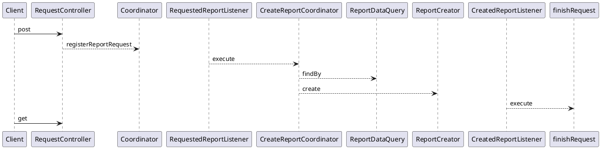

目次
=====

# 1.プレゼンテーション層

# 2.ビジネス層

## Query, Command, Coordinator

# 3.インフラストラクチャー層

# ファイルダウンロード

```puml
@startuml
Client -> RequestController: post
RequestController --> Coordinator: registerReportRequest
RequestedReportListener --> CreateReportCoordinator: execute
CreateReportCoordinator  --> ReportDataQuery: findBy
CreateReportCoordinator  --> ReportCreator: create
CreatedReportListener --> finishRequest: execute

Client -> RequestController: get

@enduml


```
