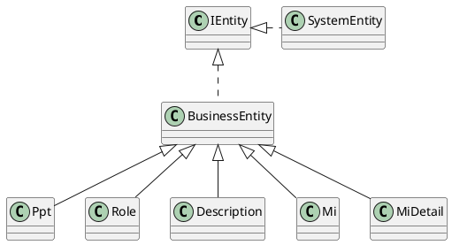
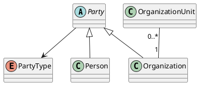

目次
---

# Jpaとは

# Entity

```java

@Table(name = "SomeEntity")
@Entity
@Data
class AnyEntity {

  @Id
  private Lomg anyEntityId;

  private String code;

}
```

## 主キーの扱い

## カラム

## アソシエート

### 1:1

### 1:n

### n:m

## アノテーション

### Entity

### Table

### Embeddable

### Embedded

### Enum

### Id

### Inheritance

### MappedSuperclass

## 実装例

### Entity



### Ppt PartyPlaceThing



### Repository

```java

@Entity
@Table(name = "parties")
class Party {

  @Id
  private SnowflakeId id;
  @Embeded
  @Attribute(name = "simpleName")
  private SimpleName simpleName;

}

```

# Repository

## メソッド名

## 証跡
